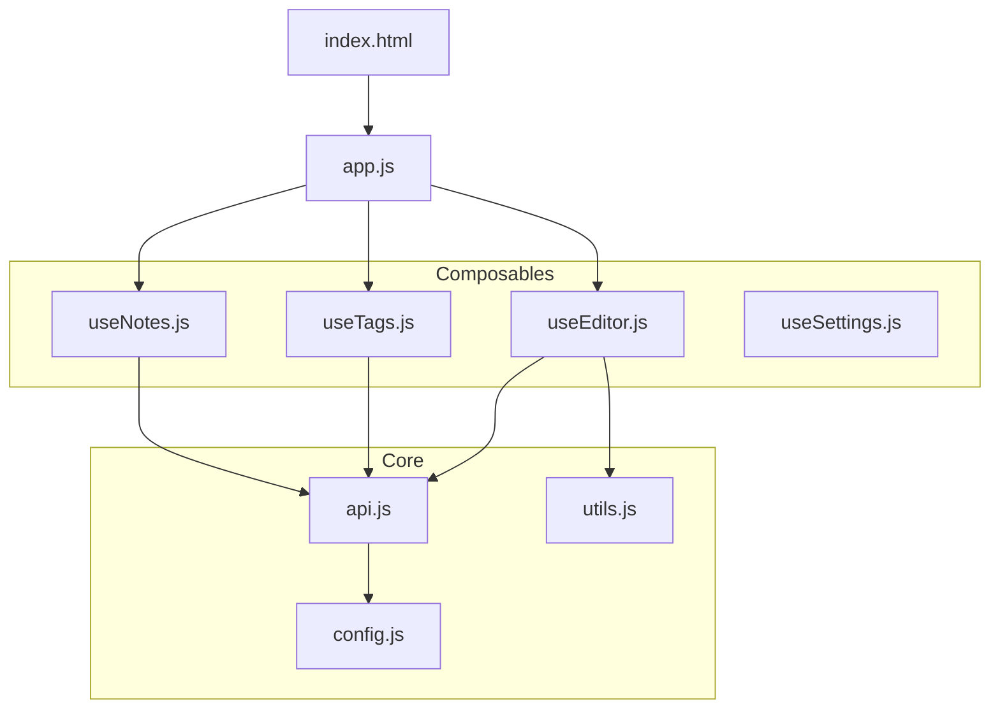

# Local Insight - 技術規格書

**版本**: v1.1.0
**日期**: 2025-12-11
**架構**: Local Web App (Flask + SQLite + Vue.js)
**修訂**: v1.1.0 - 匯入功能 + 資料庫維護 + 啟動引導

---

## 1. 專案概述

### 1.1 目標

構建一個輕量化、去中心化、本機執行的網頁應用程式，用於高效管理使用者的 AI 提示詞、技術筆記、學習資源與教學文檔。

### 1.2 核心價值

- **視覺化管理**: 透過瀑布流 (Masonry Layout) 與卡片式介面，提供直觀的內容預覽
- **零依賴部署**: 不依賴 Docker/Node.js，僅需 Python 即可運行
- **高維度檢索**: Type（分類）+ Tags（標籤）的雙重過濾機制
- **快速捕捉**: 專用提示詞 (Prompt) 快速新增窗口，專注於輸入標題、內容與圖片
- **批次管理**: 複選模式支援批次刪除與全選 (Ctrl+A)
- **離線優先**: 前端資源本地化，確保無網路環境下可正常使用

---

## 2. 技術堆疊

| 層級              | 技術選型         | 用途                                                        | 部署方式         |
| ----------------- | ---------------- | ----------------------------------------------------------- | ---------------- |
| **後端**          | Python 3 + Flask | 處理 API 路由、檔案上傳、資料庫 CRUD                        | 本機執行         |
| **資料庫**        | SQLite 3         | 單檔存儲，啟用 Foreign Keys 約束                            | 本機檔案         |
| **前端框架**      | Vue.js 3         | SPA 頁面邏輯、數據綁定、即時過濾                            | **本地靜態檔案** |
| **UI 框架**       | Tailwind CSS     | 響應式佈局、深色模式樣式                                    | **本地靜態檔案** |
| **Markdown 渲染** | Marked.js        | 前端即時預覽                                                | **本地靜態檔案** |
| **建構工具**      | None             | 為了 **可攜性** 與 **簡易部署**，刻意不使用 Node.js/Webpack | -                |

⚠️ **重要變更 (v0.1)**: 所有前端資源必須下載至 `static/` 目錄，**禁止使用 CDN**，確保離線可用性。

> **決策註記**: 曾評估導入 Node.js 生態系以獲得更佳的開發體驗與 WYSIWYG 編輯器支援，但為了維持「單一 Python 環境即可執行」的簡易部署與可攜性原則，最終決定維持現有架構。

---

## 3. 資料庫設計

### 3.1 實體關係圖 (ERD)

```
Notes (1) ──< (N) Source_Urls
Notes (N) ──< (N) Tags  [透過 Note_Tags 中介表]
```

### 3.2 資料表說明

詳見 `SCHEMA.md`

---

## 4. API 路由規劃

### 4.1 Notes CRUD

| 方法   | 路由                        | 功能                         | Request Params/Body                               | Response                                                                                             |
| ------ | --------------------------- | ---------------------------- | ------------------------------------------------- | ---------------------------------------------------------------------------------------------------- |
| GET    | `/api/notes`                | 取得筆記列表（**支援分頁**） | **Query**: `page=1` (預設), `per_page=20` (預設)  | `{"status": "success", "data": [notes...], "pagination": {"page": 1, "per_page": 20, "total": 100}}` |
| GET    | `/api/notes/<id>`           | 取得單一筆記詳情             | -                                                 | `{"status": "success", "data": {note, urls, tags}}`                                                  |
| POST   | `/api/notes`                | 新增筆記                     | `{title, content, type, remarks, tags[], urls[]}` | `{"status": "success", "data": {note_id}}`                                                           |
| PUT    | `/api/notes/<id>`           | 更新筆記                     | 同上                                              | `{"status": "success"}`                                                                              |
| PUT    | `/api/notes/<id>`           | 更新筆記                     | 同上                                              | `{"status": "success"}`                                                                              |
| DELETE | `/api/notes/<id>`           | 刪除筆記                     | -                                                 | `{"status": "success"}`                                                                              |
| POST   | `/api/notes/<id>/duplicate` | 複製筆記 (v1.2)              | -                                                 | `{"status": "success", "data": {note_id}}`                                                           |

#### **📌 分頁與篩選規範 (v0.5 更新)**

- **page**: 頁碼（從 1 開始），預設 `1`
- **per_page**: 每頁筆記數量，預設 `20`，最大 `100`
- **q**: 搜尋關鍵字，搜尋標題與內容 (LIKE) 🆕 v0.5
- **type**: 類型過濾 (空或 `all` 表示不過濾) 🆕 v0.5
- **tag**: 標籤 ID 過濾 (多個用逗號分隔，AND 邏輯) 🆕 v0.5
- **回傳格式**:
  ```json
  {
    "status": "success",
    "data": [...],
    "pagination": {
      "page": 1,
      "per_page": 20,
      "total": 156,        // 總筆記數
      "total_pages": 8     // 總頁數
    }
  }
  ```

#### **📌 資料格式規範 (v1.0 重構)**

- **標籤與網址**: 後端使用 `json_group_array` 函數，直接返回標準 JSON 陣列。
- **前端解析**: 直接使用 `JSON.parse` (或透過 API wrapper 自動處理)，不再需要 `split('||')`。
- **舊版相容**: `||` 分隔符方式已棄用，但在特定舊介面上仍可能保留支援。

### 4.2 Tags 管理

| 方法   | 路由              | 功能         | Request/Response                                                                              |
| ------ | ----------------- | ------------ | --------------------------------------------------------------------------------------------- |
| GET    | `/api/tags`       | 取得所有標籤 | Response: `{"status": "success", "data": [{id, name, count}, ...]}`                           |
| PUT    | `/api/tags/<id>`  | 重命名標籤   | Request: `{name: "新名稱"}` <br> Response: `{"status": "success"}`                            |
| DELETE | `/api/tags/<id>`  | 刪除標籤     | Response: `{"status": "success"}`                                                             |
| POST   | `/api/tags/merge` | 合併標籤     | Request: `{source_tag_ids: [1,2,3], target_tag_id: 4}` <br> Response: `{"status": "success"}` |

#### **📌 Tags 管理規範 (v0.2 新增)**

**重命名標籤 (PUT /api/tags/<id>)**

- 驗證新名稱不可為空
- 檢查新名稱是否已存在 (UNIQUE 約束)
- 更新 Tags 表，自動影響所有關聯的筆記
- 錯誤回應:
  - 名稱為空: `{"status": "error", "message": "Tag name cannot be empty"}`
  - 名稱重複: `{"status": "error", "message": "Tag name already exists"}`
  - ID 不存在: `{"status": "error", "message": "Tag not found"}`

**刪除標籤 (DELETE /api/tags/<id>)**

- 利用 CASCADE DELETE 自動移除 Note_Tags 關聯
- 被刪除的標籤會從所有筆記中移除
- 錯誤回應:
  - ID 不存在: `{"status": "error", "message": "Tag not found"}`

**合併標籤 (POST /api/tags/merge)**

- 將多個標籤的所有關聯轉移到目標標籤
- 使用 `INSERT OR IGNORE` 避免重複關聯
- 刪除原始標籤
- 請求範例:
  ```json
  {
    "source_tag_ids": [1, 2, 3],
    "target_tag_id": 4
  }
  ```
- 錯誤回應:
  - 參數缺失: `{"status": "error", "message": "Missing required parameters"}`
  - 目標標籤不存在: `{"status": "error", "message": "Target tag not found"}`
  - 來源標籤列表為空: `{"status": "error", "message": "Source tags list cannot be empty"}`

### 4.3 檔案上傳

| 方法 | 路由          | 功能     | Request           | Response                                                            |
| ---- | ------------- | -------- | ----------------- | ------------------------------------------------------------------- |
| POST | `/api/upload` | 上傳圖片 | `form-data: file` | `{"status": "success", "data": {"url": "/static/uploads/xxx.jpg"}}` |

**上傳限制**:

- 檔案大小: < 5MB
- 格式白名單: jpg, jpeg, png, webp, gif
- 儲存路徑: `static/uploads/` (以時間戳命名避免衝突)

#### **🔒 安全性規範 (v0.1 新增)**

1. **副檔名驗證**: 檢查 `filename.rsplit('.', 1)[1].lower()` 是否在白名單內
2. **Magic Numbers 檢查**:
   - 使用 `python-magic` 或 `imghdr` 模組檢查檔案真實格式
   - 禁止上傳偽裝成圖片的 `.exe`, `.php`, `.js` 等可執行檔案
3. **內容安全**:
   - 檔案儲存路徑必須使用 `werkzeug.utils.secure_filename()` 過濾
   - 確保 `static/uploads/` 目錄不可執行腳本 (需 Web Server 配置)
4. **錯誤處理**:
   - 檔案格式不符: `{"status": "error", "message": "Invalid file type"}`
   - 檔案過大: `{"status": "error", "message": "File too large (max 5MB)"}`
   - 檔案內容可疑: `{"status": "error", "message": "File content validation failed"}`

### 4.5 匯出與備份 (v0.2 新增)

| 方法 | 路由               | 功能                | Response                           |
| ---- | ------------------ | ------------------- | ---------------------------------- |
| GET  | `/api/export/json` | 匯出所有資料 (JSON) | `application/json` (Download)      |
| GET  | `/api/export/db`   | 匯出資料庫檔案      | `application/x-sqlite3` (Download) |

### 4.4 前端靜態頁面

| 方法 | 路由              | 功能                                        |
| ---- | ----------------- | ------------------------------------------- |
| GET  | `/`               | 渲染 `templates/index.html` (主應用)        |
| GET  | `/prompt-builder` | 渲染 `templates/prompt-builder.html` (v1.6) |

### 4.5 Prompt Builder (結構化提示詞組裝器 v0.6)

**定位**: 純前端工具，無須 LLM API。用於將表單參數組裝成 JSON 或 Text。

**功能**:

- **快速模板**: 預設風格按鈕 (電影感、賽博龐克等)
- **參數選單**: 景別、鏡頭運動、拍攝角度、對焦、藝術風格、光線、色調、品質
- **負面提示**: 獨立輸入框
- **即時預覽**: Text 模式 (逗號分隔) / JSON 模式
- **儲存至筆記庫**: 呼叫 `POST /api/notes`

**配置檔**: `/static/config/prompt_options.json`

---

## 5. 功能需求與實作對應

### 5.1 瀏覽與檢索 (View & Search)

| 功能             | 實作方式                                                                                         |
| ---------------- | ------------------------------------------------------------------------------------------------ |
| **瀑布流佈局**   | Vue 組件使用 CSS Grid，前端動態計算                                                              |
| **Type 過濾**    | 側邊欄單選按鈕，Vue computed 過濾 `notes.filter(n => n.type === selectedType)`                   |
| **Tags 多選**    | Checkbox 群組，Vue computed 過濾 `notes.filter(n => n.tags.some(t => selectedTags.includes(t)))` |
| **即時搜尋**     | 輸入框綁定 `v-model="searchKeyword"`，computed 過濾 title/content/tags                           |
| **卡片懸停顯示** | CSS `:hover` + Tailwind `group-hover` 顯示 remarks                                               |
| **分頁載入**     | 前端使用 `?page=N` 參數呼叫 API，實作「載入更多」或頁碼導航                                      |

### 5.2 內容編輯 (Editor)

| 功能                     | 實作方式                                                                                                                            |
| ------------------------ | ----------------------------------------------------------------------------------------------------------------------------------- |
| **Modal 彈窗**           | Vue 條件渲染 `v-if="isEditing"`，背景模糊 `backdrop-blur`                                                                           |
| **眼睛切換預覽** ⭐ v1.4 | 內容編輯區右上角提供「👁️ 眼睛」按鈕，點擊切換編輯/預覽模式：睜眼=預覽、閉眼=編輯。較 Split View 節省空間，且不需引入 WYSIWYG 複雜度 |
| **多網址管理**           | Vue 陣列 `urls: []`，使用 `v-for` 渲染輸入框，提供 Add/Remove 按鈕                                                                  |
| **圖片上傳**             | `<input type="file">` 觸發 `/api/upload`，成功後插入 `` 到編輯器游標位置                                                    |
| **剪貼簿圖片貼上**       | 監聽 `paste` 事件 → 檢測 `clipboardData.items` → 篩選 `image/*` → 呼叫 `/api/upload` → 自動插入 Markdown 語法或設為封面 URL ⭐ v1.3 |
| **智慧封面**             | 前端解析 Markdown 的第一個 `` 作為封面；無圖片時根據 Type 顯示預設色塊                                                      |
| **XSS 防護**             | 使用 DOMPurify 清理 `v-html` 渲染的 Markdown HTML，防止注入攻擊 🔒 v1.3                                                             |
| **Tags 管理**            | 顯示已選標籤 badge、新增輸入框、現有標籤快速選擇，支援防重複機制 🟡 v1.3                                                            |

> **設計決策 (2025-12-06)**: 選擇「眼睛切換」方案而非 Split View 或 WYSIWYG，原因：
>
> - 節省螢幕空間
> - 維持 Markdown 編輯方式
> - 不需引入額外依賴套件 (符合簡單部署原則)

### 5.3 系統邏輯

| 功能         | 實作方式                                                                    |
| ------------ | --------------------------------------------------------------------------- |
| **智慧封面** | 後端儲存 `cover_image` 欄位；前端優先顯示此欄位，若為 NULL 則解析 content   |
| **時間戳記** | SQLite 使用 `CURRENT_TIMESTAMP` 作為預設值；更新時後端自動更新 `updated_at` |
| **排序**     | 前端預設以 `updated_at DESC` 排序                                           |

### 5.4 快速提示詞窗口 (Quick Prompt) - v0.3

| 功能         | 實作方式                                                                     |
| ------------ | ---------------------------------------------------------------------------- |
| **精簡介面** | 隱藏 Type (預設為提示詞)、Remarks、手動封面 URL 等非必要欄位                 |
| **專注輸入** | 僅顯示：標題、圖片貼上/預覽、內容、標籤、來源網址                            |
| **模式切換** | 使用 `openEditor(null, 'prompt')` 觸發，設置 `isPromptMode` 狀態控制 UI 顯示 |

### 5.5 複選模式 (Batch Selection) - v0.3

| 功能         | 實作方式                                                                          |
| ------------ | --------------------------------------------------------------------------------- |
| **模式切換** | 點擊「複選」按鈕切換 `isSelectionMode`                                            |
| **視覺回饋** | 進入模式後，卡片顯示 Checkbox 遮罩；Toolbar 顯示已選數量與操作按鈕                |
| **全選操作** | 點擊 Toolbar「全選」按鈕或按下 `Ctrl+A` (僅在複選模式下生效) 選取當前列表所有筆記 |
| **批次刪除** | 呼叫 `DELETE /api/notes/<id>` 迴圈執行刪除，並提供確認對話窗                      |

### 5.6 檢視模式切換 (View Mode) - v0.4

| 功能         | 實作方式                                                           |
| ------------ | ------------------------------------------------------------------ |
| **格狀模式** | 3 欄響應式卡片佈局 (`grid-cols-1 md:grid-cols-2 lg:grid-cols-3`)   |
| **列表模式** | 單行橫向佈局，左側縮圖 + 右側文字 (標題、摘要、標籤、日期)         |
| **切換按鈕** | Header 右側的圖示按鈕，高亮顯示當前模式                            |
| **狀態管理** | `viewMode` state ('grid' \| 'list')，條件渲染 `v-else-if` 切換視圖 |

### 5.7 側邊欄標籤互動 (Tag Sidebar) - v0.4

| 功能         | 實作方式                                               |
| ------------ | ------------------------------------------------------ |
| **整區可點** | 點擊標籤整行即可切換選取，而非僅限 checkbox            |
| **選中高亮** | 選中狀態顯示藍色背景 (`bg-blue-600/20`) 與藍色文字     |
| **右鍵選單** | 右鍵點擊標籤可進行「重新命名」、「合併」、「刪除」操作 |
| **確認提示** | 操作前顯示詳細確認對話框，說明影響的筆記數量與後果     |

---

## 6. 命名規範 (Naming Conventions) - v0.6.8

> **統一說明**: 為確保程式碼的一致性與可維護性，專案遵循以下命名規則。

### 6.1 後端 (Python/Flask)

| 元素   | 命名規則     | 範例                                 |
| ------ | ------------ | ------------------------------------ |
| 函數   | `snake_case` | `get_notes()`, `batch_update_type()` |
| 變數   | `snake_case` | `note_id`, `per_page`, `is_pinned`   |
| 路由   | `kebab-case` | `/api/notes`, `/api/tags/merge`      |
| 資料表 | `PascalCase` | `Notes`, `Note_Tags`, `Categories`   |
| 欄位   | `snake_case` | `created_at`, `cover_image`          |

### 6.2 前端 (JavaScript/Vue.js)

| 元素         | 命名規則     | 範例                                   |
| ------------ | ------------ | -------------------------------------- |
| 變數/函數    | `camelCase`  | `fetchNotes()`, `isSettingsOpen`       |
| Composable   | `useCamel`   | `useNotes`, `useSettings`, `useEditor` |
| 常數         | `UPPER_CASE` | `API_BASE_URL`, `MAX_FILE_SIZE`        |
| Ref/Reactive | `camelCase`  | `categories`, `catForm`, `catEditMode` |
| 事件處理     | `onCamel`    | `onClick`, `onSubmit`, `onMounted`     |

### 6.3 分類管理函數 (Category Functions)

| 函數名稱          | 用途             |
| ----------------- | ---------------- |
| `catLoadList()`   | 載入分類列表     |
| `catCreate()`     | 新增分類         |
| `catStartEdit()`  | 開始編輯分類     |
| `catCancelEdit()` | 取消編輯         |
| `catSaveEdit()`   | 儲存編輯         |
| `catDelete()`     | 刪除分類         |
| `catForm`         | 分類表單狀態物件 |
| `catEditMode`     | 是否處於編輯模式 |

---

## 7. 前端組件架構 (ES Modules)

> **重構說明 (v0.6.1)**: 為解決單一檔案難以維護問題，前端將採用原生 ES Modules 進行模組化拆分，無需編譯工具即可在本機執行。

### 6.1 依賴樹 (Dependency Tree)



### 6.2 模組職責

| 模組       | 路徑                                 | 職責                                         |
| :--------- | :----------------------------------- | :------------------------------------------- |
| **Entry**  | `static/js/app.js`                   | 應用程式入口，負責 `createApp` 與掛載        |
| **API**    | `static/js/api.js`                   | 封裝所有 `fetch` 請求，處理錯誤與攔截器      |
| **Utils**  | `static/js/utils.js`                 | 通用工具 (Debounce, Date Format, File Check) |
| **Notes**  | `static/js/composables/useNotes.js`  | 筆記狀態管理 (CRUD, Filter, Pagination)      |
| **Tags**   | `static/js/composables/useTags.js`   | 標籤狀態管理 (Fetch, Rename, Merge)          |
| **Editor** | `static/js/composables/useEditor.js` | 編輯器邏輯 (Modal, Upload, Paste)            |

---

## 7. 目錄結構

```
LocalInsight/
├── app.py                    # Flask 應用入口
├── knowledge.db              # SQLite 資料庫
├── requirements.txt          # Python 依賴清單
├── migrations/               # ⭐ 資料庫遷移腳本 (v2.0)
├── routes/                   # ⭐ 後端路由模組 (v2.0 拆分)
│   ├── notes/                # Notes 子模組
│   │   ├── crud.py
│   │   ├── actions.py
│   │   └── ...
│   └── ...
├── static/
│   ├── config/               # 設定檔 (prompt_options.json)
│   ├── uploads/              # 使用者上傳圖片
│   ├── js/                   # ⭐ Vue.js 模組化代碼
│   │   ├── app.js            # Entry Point
│   │   ├── api.js            # API Service
│   │   ├── utils.js          # Helpers
│   │   ├── composables/      # Logic Modules (useNotes, useTags...)
│   │   └── vue.global.js     # Vendor Lib
│   ├── css/                  # Tailwind CSS
│   └── lib/                  # Marked.js, DOMPurify
└── templates/
    ├── index.html            # 主應用入口
    └── prompt-builder.html   # Prompt Builder 入口
```

---

## 8. UI 設計規範

### 8.1 色彩系統 (Dark Mode)

| 元素     | Tailwind Class   | 色碼    |
| -------- | ---------------- | ------- |
| 背景     | `bg-slate-900`   | #0f172a |
| 卡片     | `bg-slate-800`   | #1e293b |
| 文字     | `text-slate-100` | #f1f5f9 |
| 次要文字 | `text-slate-400` | #94a3b8 |
| 強調色   | `text-blue-500`  | #3b82f6 |

### 8.2 響應式斷點

| 斷點 | 寬度   | 佈局變化          |
| ---- | ------ | ----------------- |
| `sm` | 640px  | 手機單欄          |
| `md` | 768px  | 平板雙欄          |
| `lg` | 1024px | 桌面三欄 + 側邊欄 |

---

## 9. 部署與執行

### 9.1 環境需求

- Python 3.8+
- 無需額外資料庫服務
- **新增**: `python-magic` (檔案類型檢測)

### 9.2 啟動步驟

```bash
# 1. 安裝依賴
pip install -r requirements.txt

# 2. 執行應用 (開發模式)
python app.py

# 3. 執行應用 (生產模式)
export FLASK_ENV=production  # Linux/Mac
set FLASK_ENV=production     # Windows
python app.py

# 4. 開啟瀏覽器
http://localhost:5000
```

### 9.3 資料庫初始化

首次執行時，`app.py` 自動檢查 `knowledge.db` 是否存在：

- 若不存在，自動執行 Schema 建立 SQL
- 若存在，直接連接

---

## 10. 環境配置與安全性

### 10.1 環境變數管理

| 變數名            | 用途         | 預設值                        | 必填 |
| ----------------- | ------------ | ----------------------------- | ---- |
| `FLASK_ENV`       | 運行模式     | `development`                 | ❌   |
| `FLASK_DEBUG`     | Debug 模式   | `True` (dev) / `False` (prod) | ❌   |
| `DATABASE_PATH`   | 資料庫路徑   | `./knowledge.db`              | ❌   |
| `UPLOAD_FOLDER`   | 上傳目錄     | `./static/uploads`            | ❌   |
| `MAX_UPLOAD_SIZE` | 上傳大小限制 | `5242880` (5MB)               | ❌   |

### 10.2 安全性檢查清單

- [ ] **生產環境禁止 Debug 模式**: 確保 `app.run(debug=False)` 或透過環境變數控制
- [ ] **檔案上傳 Magic Numbers 驗證**: 使用 `python-magic` 檢查真實檔案類型
- [ ] **輸入驗證**: API 對 `title`, `content` 長度進行限制
- [ ] **錯誤訊息**: 生產環境不可暴露完整 Exception 堆疊
- [ ] **資料庫注入防護**: 使用 SQLite 參數化查詢 (已實作)

---

## 11. 非功能需求

### 11.1 離線優先 (Offline First) - v0.1 新增

**目標**: 確保應用在無網路連線時仍可正常使用。

**實作要求**:

1. **前端資源本地化**:

   - ❌ 禁止使用 CDN (`unpkg.com`, `cdn.tailwindcss.com` 等)
   - ✅ 必須將 Vue.js, Tailwind CSS, Marked.js 下載至 `static/` 目錄
   - ✅ `index.html` 改用本地路徑：
     ```html
     <script src="/static/js/vue.global.js"></script>
     <script src="/static/js/tailwind.min.js"></script>
     <script src="/static/lib/marked.min.js"></script>
     ```

2. **資源下載清單**:
   | 資源 | 來源 | 目標路徑 |
   |-----|------|---------|
   | Vue.js 3 | https://unpkg.com/vue@3/dist/vue.global.js | `static/js/vue.global.js` |
   | Tailwind CSS | https://cdn.tailwindcss.com | `static/css/tailwind.min.js` (Standalone CLI) |
   | Marked.js | https://cdn.jsdelivr.net/npm/marked/marked.min.js | `static/lib/marked.min.js` |

3. **驗證方式**:
   - 斷開網路連線後，執行 `python app.py`
   - 瀏覽器開啟 `http://localhost:5000`，確認頁面正常渲染且功能可用

### 11.2 效能需求

| 指標                    | 目標值                 | 測試方式                                |
| ----------------------- | ---------------------- | --------------------------------------- |
| **API 回應時間** (單筆) | < 50ms                 | 使用 Postman 測試 `GET /api/notes/<id>` |
| **API 回應時間** (列表) | < 200ms (100 筆)       | 測試 `GET /api/notes?per_page=100`      |
| **前端渲染時間**        | < 500ms (100 張卡片)   | Chrome DevTools Performance             |
| **資料庫查詢**          | 使用索引，避免全表掃描 | 檢查 `EXPLAIN QUERY PLAN`               |

---

## 12. 未來擴充性考量

| 功能                    | 優先級 | 技術方案                 |
| ----------------------- | ------ | ------------------------ |
| 全文檢索                | P1     | SQLite FTS5 擴展         |
| 匯出功能 (Markdown ZIP) | P2     | Python `zipfile` 模組    |
| 暗黑/亮色主題切換       | P2     | Tailwind `dark:` variant |
| 資料同步 (多裝置)       | P3     | 整合 Git 或雲端 API      |

---

## 10. Phase 4 程式碼審核問題摘要 (2025-12-05)

### 10.1 關鍵問題 (Critical Issues)

| 問題 ID    | 問題描述                            | 優先級 | 狀態   | 影響                         |
| ---------- | ----------------------------------- | ------ | ------ | ---------------------------- |
| **CR-001** | 儲存按鈕功能缺失                    | 🔴 P0  | 待修復 | 編輯器完全無法使用，阻塞 MVP |
| **CR-002** | XSS 安全漏洞 (`v-html` 未 sanitize) | 🔴 P0  | 待修復 | 可注入惡意腳本，安全風險     |
| **CR-003** | Tags 管理 UI 完全缺失               | 🟡 P1  | 待修復 | 核心功能不完整               |

### 10.2 修復方案

**CR-001: 儲存按鈕功能缺失**

- **位置**: `templates/index.html:945-957`
- **修復**: 實作 `saveNote()` 函數，綁定 `@click="saveNote"`
- **需求**: 表單驗證、Loading 狀態、錯誤處理、資料格式轉換

**CR-002: XSS 安全漏洞**

- **位置**: `templates/index.html:912, 1281`
- **修復**: 下載 DOMPurify，使用 `DOMPurify.sanitize()` 清理 HTML
- **配置**: 限制允許的 HTML 標籤與屬性

**CR-003: Tags 管理 UI 缺失**

- **位置**: 表單區塊缺少 Tags 欄位
- **修復**: 新增已選標籤顯示、輸入框、現有標籤快速選擇
- **函數**: `addTag()`, `removeTag()`, `toggleTag()`, `isTagSelected()`

### 10.3 新功能需求

**剪貼簿圖片貼上 (Task 4.3.4)**

- 監聽 `paste` 事件
- 檢測 `clipboardData.items` 中的圖片
- 自動上傳並插入 Markdown 或設為封面
- 支援兩種模式：封面 URL 設定 / 編輯器插入

### 10.4 資料庫完整性確認

✅ **資料庫設計完整且健全**

| 儲存需求 | 資料表                                | 支援狀態    |
| -------- | ------------------------------------- | ----------- |
| 筆記主體 | Notes (title, content, type, remarks) | ✅ 完整     |
| 封面圖片 | Notes.cover_image                     | ✅ 支援 URL |
| 時間戳記 | Notes.created_at, updated_at          | ✅ 自動記錄 |
| 多個網址 | Source_Urls (1:N)                     | ✅ 完整     |
| 多個標籤 | Tags + Note_Tags (N:M)                | ✅ 完整     |

---

## 13. 進階功能規劃 (v0.6+ Roadmap)

基於商務改善報告與新一輪需求，以下為核心開發重點：

### 13.1 結構化提示詞組裝器 (Prompt Builder)

獨立於主列表的純前端工具，專注於生成高品質的 AI 繪圖/影片提示詞。

- **定位**: 參數組裝工具 (Parametric Assembler)，不串接 LLM API。
- **配置驅動**: 所有下拉選單選項 (鏡頭、光線、風格) 提取至 `static/config/prompt_options.json`，方便未來擴充。
- **UI 佈局**:
  - **左欄 (Input)**:
    - **Quick Templates**: 電影感、自然風景等預設模版按鈕。
    - **Main Prompt**: 多行文本輸入。
    - **Parameters**: 讀取 Config 生成的下拉選單 (Camera, Shot, Lighting...)。
    - **Negative Prompt**: 負面提示輸入。
  - **右欄 (Output preview)**:
    - **JSON**: 結構化輸出 `{ "prompt": "...", "style": "..." }`，支援下載/複製。
    - **Text**: 逗號分隔的純字串拼接，支援權重語法保留。

### 13.2 圖片效能虛擬化 (Image Virtualization)

針對大量圖片列表的極致效能優化策略。

- **縮圖機制 (Thumbnail Flow)**:
  - **Upload**: 後端使用 Pillow 自動生成 `original` 與 `thumb` (低解析/WebP)。
  - **List View**: 預設僅載入 `thumb`，點擊互動後才加載 `original`。
- **強制記憶體回收 (Hard Limits)**:
  - **Virtual Scrolling**: 僅渲染視窗可見範圍內的 DOM。
  - **Overscan**: 設定上下各 3 排 (約 18 張) 為緩衝區。
  - **Aggressive GC**: 滾出緩衝區的卡片強制銷毀 DOM 與釋放 Blob URL，即使造成回滾時的短暫白畫面 (Flicker) 也在所不惜，以記憶體穩定為最高原則。

### 13.3 內容管理系統升級

- **分類管理 (Category CRUD)**: 新增 `Categories` 表，支援分類的新增/修改/刪除/排序。修改名稱時自動同步更新關聯筆記。
- **批量操作 (Batch Ops)**: 列表頁複選後，可批量修改分類或「追加」標籤。
- **筆記時光機 (History)**: 引入 `Note_History` 表，每次儲存前自動快照，防止資料意外覆蓋。

### 13.4 商務與 UX 微互動

- **Prompt 一鍵複製**: 卡片 Hover 狀態提供直接複製按鈕。
- **Run Prompt**: 整合 External Link，一鍵將提示詞帶入 ChatGPT/Claude 測試。
- **View Transitions**: 使用 Vue TransitionGroup 實現列表過濾時的「洗牌」動畫。

---

## 14. Phase 8 變更日誌 (v0.7.x - v0.8.x)

> **更新日期**: 2025-12-08

### 14.1 已完成功能

| 版本   | 功能                   | 說明                                                                        |
| ------ | ---------------------- | --------------------------------------------------------------------------- |
| v0.6.8 | camelCase 命名統一     | 前端變數/函數改用 camelCase，移除別名層                                     |
| v0.6.9 | 分類與 Type 篩選同步   | 新增/編輯/刪除分類後，左側篩選列表自動更新                                  |
| v0.7.0 | 刪除分類選擇目標       | 刪除含筆記的分類時，彈出對話框讓用戶選擇目標分類                            |
| v0.7.1 | 置頂功能修復           | 修正 400 Bad Request 錯誤（POST 需發送 JSON body）                          |
| v0.7.3 | 未保存變更提示         | 關閉編輯器前檢測變更，提示用戶是否放棄                                      |
| v0.7.4 | 編輯器預覽優先         | 點擊卡片編輯時預設顯示內容預覽分頁                                          |
| v0.7.5 | 歷史版本還原修復       | 修正 GROUP_CONCAT DISTINCT 語法錯誤                                         |
| v0.7.6 | 自動載入設定           | 設定視窗新增「自動載入更多」開關                                            |
| v0.7.7 | 流暢無限滾動           | 分離 loading 狀態，避免頁面跳頂                                             |
| v0.8.0 | 孤兒圖片清理           | 掃描未引用圖片，提供批量刪除功能                                            |
| v0.8.1 | 縮圖處理優化           | 原圖被引用時，縮圖也視為被引用；設定框新增滾動條                            |
| v0.8.2 | 編輯器圖片管理         | 新增「圖片」分頁，支援複製語法/移除引用/刪除檔案                            |
| v0.8.3 | 圖片匯出功能           | 提供「匯出全部」按鈕，ZIP 打包所有圖片                                      |
| v0.8.4 | 圖片匯出改進與封面位置 | 改為逐一下載原圖；新增封面位置選項（top/center/bottom）                     |
| v0.8.5 | 編輯器雙欄模式         | 圖片左側參考，編輯右側並列；佈局偏好持久化保存                              |
| v0.8.6 | 雙欄智能切換           | 新增筆記插入圖片時自動切到雙欄；用戶可手動切換                              |
| v0.8.7 | 提示詞擴充包+混沌係數  | 160+ 新選項、鏡頭類別；混沌係數隨機生成器（Level 1/2/3 秩序/平衡/混沌模式） |
| v0.8.8 | 國際化 (i18n) 支援     | 語系檔 zh-TW/en、語言切換下拉選單、localStorage 偏好保存                    |

### 14.2 Phase 9 規劃功能 (基於 UX 報告 2025-12-07)

#### 🟢 P0 - Quick Wins (立竿見影)

| 功能           | 說明                                                          |
| -------------- | ------------------------------------------------------------- |
| Web Fonts 導入 | 引入 Inter/Outfit/JetBrains Mono，提升視覺高級感              |
| 微互動增強     | 按鈕添加 active:scale-95 transition-transform，增加點擊回饋感 |

#### 🟡 P1 - 體驗優化

| 功能         | 說明                                                      |
| ------------ | --------------------------------------------------------- |
| 品牌色彩系統 | CSS Root 定義全域色彩變數，統一首頁與 Prompt Builder 色系 |
| 移動端優化   | 檢查漢堡選單、卡片間距，確保觸控友好                      |

#### 🔴 P2 - 長期規劃

| 功能             | 說明                        |
| ---------------- | --------------------------- |
| 編輯器全螢幕模式 | 無干擾深度寫作環境          |
| 拖放排序         | 瀑布流/分類列表支援拖曳排序 |

### 14.3 圖片儲存優化 (Phase 9)

| 功能             | 說明                                                     |
| ---------------- | -------------------------------------------------------- |
| 貼上圖片僅存縮圖 | 新增設定選項，節省儲存空間                               |
| 一鍵刪除所有原圖 | 批量刪除原圖，自動修正筆記中的圖片路徑                   |
| 圖片路徑自動修正 | 原圖不存在時自動降級使用縮圖，處理用戶直接刪除原圖的情況 |

### 14.4 資料庫效能規劃 (長期)

- **現狀**: 所有筆記內容存於單一 `knowledge.db`
- **評估方案**: 按時間分表 / 內容外部化 (.md) / 附件分離
- **時機**: 待各項功能穩定後，根據實際使用量評估是否分拆

### 14.5 前端模板模組化 (Phase 9.5)

將 `templates/index.html` (3,500+ 行) 拆分為 Jinja2 組件：

| 組件檔案                          | 內容                       | 預估行數 |
| --------------------------------- | -------------------------- | -------- |
| `components/_header.html`         | 頂部導航欄、搜尋框、按鈕   | ~400     |
| `components/_sidebar.html`        | 分類/標籤過濾、移動端遮罩  | ~160     |
| `components/_note-grid.html`      | 卡片網格/列表、載入狀態    | ~520     |
| `components/_editor-modal.html`   | 編輯器 Modal 完整 UI       | ~1,300   |
| `components/_settings-modal.html` | 設定對話框                 | ~870     |
| `components/_context-menus.html`  | 右鍵選單、重命名/合併      | ~100     |
| `components/_scripts.html`        | Vue 初始化、Module imports | ~94      |

**整合方式**: 使用 ``

### 14.6 Phase 9 視覺優化完成 (v0.9.0)

\u003e **完成日期**: 2025-12-09

#### ✅ 已實作功能

| 版本   | 功能                     | 說明                                                                     |
| ------ | ------------------------ | ------------------------------------------------------------------------ |
| v0.9.0 | Web Fonts 導入           | 引入 Inter Tight 字體系統 (400/500/600/700/800)，本地 woff2 檔案離線優先 |
| v0.9.0 | 微互動增強               | 所有按鈕 `active:scale(0.95)`、卡片 hover lift、輸入框 focus 平滑過渡    |
| v0.9.0 | 主題色彩系統             | 6 套主題動態切換 (Blue/Cyberpunk/Eye-Care/Elegant/Ocean/Sunset)          |
| v0.9.0 | 主題感知 Utility Classes | 全域替換硬編碼 Tailwind 顏色為主題變數                                   |
| v0.9.0 | 移動端優化               | 漢堡菜單、側邊欄滑入動畫、響應式間距、觸控目標優化                       |
| v0.9.0 | 拖放排序 (Drag & Drop)   | 支援筆記卡片自由拖曳排序 (需切換至 Sort: Custom 模式)                    |

#### 主題色彩系統架構

**實作原理**:

- CSS 變數定義 6 套主題色盤 (`[data-theme="..."]`)
- JavaScript 動態應用 `document.documentElement.setAttribute('data-theme', theme)`
- localStorage 持久化用戶偏好 (`colorTheme`)
- 模板使用主題感知類別 (`.bg-theme-surface`, `.text-theme-primary`)

**已驗證主題**:

1. **Professional Blue** (`default`) - 專業藍，深灰色調背景
2. **Cyberpunk** - 霓虹粉紫，賽博風格
3. **Eye-Care** - 護眼綠，柔和綠色調
4. **Elegant Gold** - 典雅金，暖色調質感
5. **Ocean Teal** - 海洋青綠，清新透亮
6. **Sunset Orange** - 夕陽橙，活力溫暖

**替換範圍**:

- ✅ Index 主頁組件 (7 個檔案)
- ✅ Prompt Builder 組件 (4 個檔案)
- ✅ 所有 Modal 對話框、卡片、按鈕、表單元素

**設計規範參考**: 詳見 `SCHEMA.md` Section 11 - CSS 設計系統

---

### 14.7 Phase 10 架構重構 (v1.0.0)

> **完成日期**: 2025-12-09

#### 核心變更

1. **模組拆分**: `routes/notes.py` (1,028 行) 拆分為 `crud`, `actions`, `history`, `batch` 等子模組。
2. **遷移系統**: 建立 `migrations/` 目錄，引入聲明式版本化遷移，移除 `app.py` 中散亂的 `if` 邏輯。
3. **查詢重構**: 改用 `json_group_array()` 取代 `GROUP_CONCAT`，提升資料正確性與解析效能。
4. **Schema 升級**: 新增 `Schema_Meta` 表與 `Notes.category_id` 外鍵。

---

### 14.8 審核報告整合 (2025-12-09)

> **來源**: `Gemini3Pro-High-綜合報告-1209.md`, `Performance_Audit_1209.md` > **篩選原則**: Linus Torvalds 風格 - 只修真正的 bug，拒絕純審美變更

#### 已接受建議 (納入 Phase 12)

| 類別      | 問題                      | 狀態   |
| --------- | ------------------------- | ------ |
| 🔴 技術債 | CSS `!important` 暴力覆蓋 | 已修復 |
| 🔴 無障礙 | `focus:ring-0` 隱形焦點   | 已修復 |
| 🔴 無障礙 | Modal 缺 ESC 關閉         | 已修復 |
| 🟡 無障礙 | Hover-only 按鈕缺 focus   | 已修復 |
| 🟡 無障礙 | Toggle Switch 缺 focus    | 已修復 |
| 🟢 UX     | Prompt Builder 快捷鍵     | 已實作 |
| 🟢 長期   | DOM 虛擬化 (>500 筆記)    | 監控中 |

#### 已拒絕建議

| 建議                 | 拒絕理由                         |
| -------------------- | -------------------------------- |
| 引入 Outfit 字體     | 增加載入時間，解決沒人抱怨的問題 |
| 漸層按鈕改單色       | 純審美偏好，現有設計可用         |
| 輸入框「去除泥濘感」 | Linear 風格不是本專案目標        |

**完整規劃**: 詳見 `TODO.md` Phase 12

---

### 14.9 Bug 修復與新功能 (2025-12-10)

#### 修復

| 問題                | 說明                                                                                  |
| ------------------- | ------------------------------------------------------------------------------------- |
| Prompt Builder 黑屏 | 修正 Vue 模板中 `t()` 函數換行導致的編譯錯誤                                          |
| Prompt Builder 閃屏 | 加入 `v-cloak` 隱藏未編譯的原始模板                                                   |
| 歷史資料殘留        | 刪除筆記時自動清除 `Note_History`、`Note_Tags`、`Source_Urls` (應用層 Cascade Delete) |

#### 新功能

| 功能         | 說明                                                                  |
| ------------ | --------------------------------------------------------------------- |
| 清空單筆歷史 | 編輯器歷史分頁新增「清空紀錄」按鈕 (`DELETE /api/notes/<id>/history`) |
| 歡迎筆記     | 全新資料庫自動生成引導筆記                                            |
| 深度清理工具 | `scripts/deep_clean.py` 清除孤兒資料 + FTS 重建                       |

---

### 14.10 Phase 13 規劃 (2025-12-11)

| 功能              | 說明                               |
| ----------------- | ---------------------------------- |
| 13.1 匯入功能     | 設定頁匯入 .md 建立筆記            |
| 13.2 編輯器模式   | 純文字預設 + Markdown 切換         |
| 13.3 首次啟動引導 | 詢問自動開瀏覽器偏好，可在設定更改 |

---

### 14.11 2025-12-11 審計報告 (v1.1.1)

> 📄 來源: `MVP_Audit_Report-1211.md`, `MVP_UX_Audit_Report-1211.md`

#### 技術審計發現

| 分類    | 問題                              | 狀態   |
| ------- | --------------------------------- | ------ |
| 🔴 資料 | Notes.category_id 未被 CRUD 寫入  | 待修復 |
| 🟡 遷移 | app.py init_db 與 migrations 重疊 | 監控中 |

#### UX 審計發現

| 分類  | 問題                          | 狀態   |
| ----- | ----------------------------- | ------ |
| 🔴 UX | Prompt Builder 錯誤狀態死胡同 | 待修復 |
| 🔴 UX | 搜尋無結果誤導為「無資料」    | 待修復 |
| 🔴 UX | 手機版側邊欄過濾後遮擋結果    | 待修復 |
| 🟡 UX | Quick Add / New Note 競爭     | 可選   |
| 🟡 UX | Markdown WYSIWYG 門檻         | 延後   |

---

**END OF Local Insight.md (v1.1.1 - Updated 2025-12-11)**
