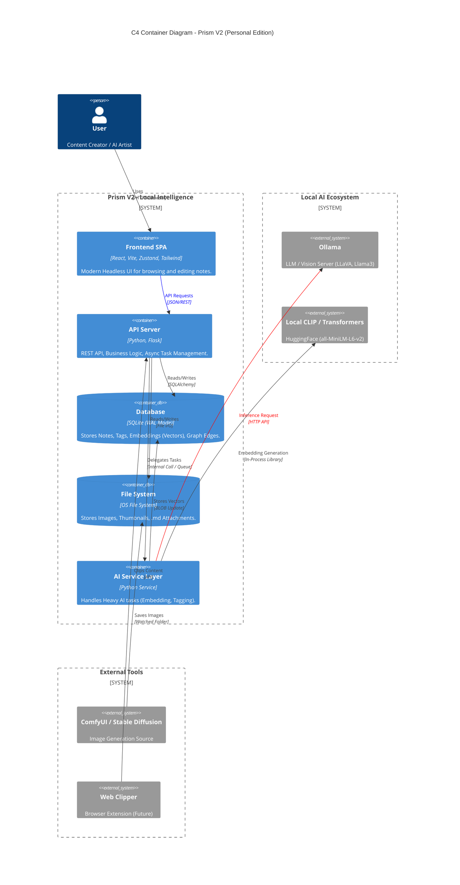

# System Architecture (C4 Model)

```mermaid
C4Context
      title C4 Container Diagram - Prism V2 (Personal Edition)

      Person(user, "User", "Content Creator / AI Artist")

      System_Boundary(prism_v2, "Prism V2 - Local Intelligence") {
            
            Container(frontend, "Frontend SPA", "React, Vite, Zustand, Tailwind", "Modern Headless UI for browsing and editing notes.")
            Container(backend, "API Server", "Python, Flask", "REST API, Business Logic, Async Task Management.")
            
            ContainerDb(sqlite, "Database", "SQLite (WAL Mode)", "Stores Notes, Tags, Embeddings (Vectors), Graph Edges.")
            ContainerDb(fs, "File System", "OS File System", "Stores Images, Thumbnails, .md Attachments.")

            Container(ai_service, "AI Service Layer", "Python Service", "Handles Heavy AI tasks (Embedding, Tagging).")
      }

      System_Boundary(external_ai, "Local AI Ecosystem") {
            System_Ext(ollama, "Ollama", "LLM / Vision Server (LLaVA, Llama3)")
            System_Ext(clip, "Local CLIP / Transformers", "HuggingFace (all-MiniLM-L6-v2)")
      }

      System_Boundary(integrations, "External Tools") {
            System_Ext(comfyui, "ComfyUI / Stable Diffusion", "Image Generation Source")
            System_Ext(clipper, "Web Clipper", "Browser Extension (Future)")
      }

      Rel(user, frontend, "Uses", "HTTPS/Browser")
      
      Rel(frontend, backend, "API Requests", "JSON/REST")
      Rel(backend, sqlite, "Reads/Writes", "SQLAlchemy")
      Rel(backend, fs, "Reads/Writes", "File I/O")
      
      Rel(backend, ai_service, "Delegates Tasks", "Internal Call / Queue")
      
      Rel(ai_service, ollama, "Inference Request", "HTTP API")
      Rel(ai_service, clip, "Embedding Generation", "In-Process Library")
      Rel(ai_service, sqlite, "Stores Vectors", "BLOB Update")

      Rel(comfyui, fs, "Saves Images", "Watched Folder")
      Rel(clipper, backend, "Clips Content", "API")

      UpdateRelStyle(frontend, backend, $textColor="blue", $lineColor="blue")
      UpdateRelStyle(ai_service, ollama, $textColor="red", $lineColor="red")
```
