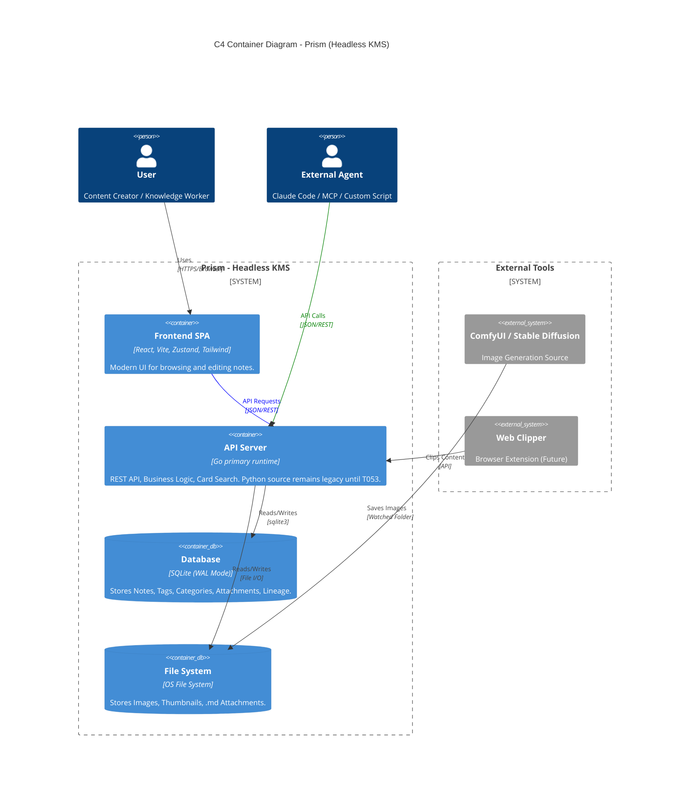
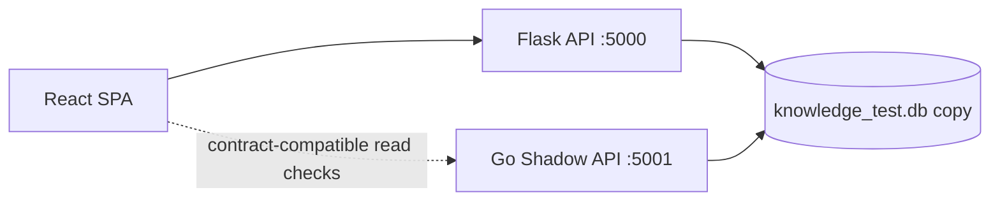

# System Architecture (C4 Model)

## Search Read Path

`GET /api/notes?q=...` 維持單一查詢入口：

- `Notes.title` / `Notes.content` 使用 SQLite FTS5 (`Notes_FTS`)。
- `Notes.remarks`、`Tags.name`、`Note_Attachments.title` / `file_path` 使用 SQL 關聯條件。
- 文字附件內容（`.md` / `.markdown` / `.txt`）由後端在 request 期間 read-only 掃描檔案內容，再把命中的 `note_id` 併回 SQL 條件。

此搜尋仍是純關鍵字比對，沒有 AI / embedding / 外部服務依賴。

## Planned Modernization Boundary

> 本節是 2026-05-27 的規劃邊界，不代表目前 runtime 已改成 Go 或新 UI。

### Go Shadow Backend

`docs/development-history/Prism_Go_模組逐步重構計劃報告.md` 保存的是早期平行 read-only shadow backend 規劃；本段僅作歷史脈絡，不代表目前 live/default runtime truth：

- Phase 0-1 只允許 read-only endpoints: `/api/test`、categories、tags、notes list、note detail、system read checks。
- Go 開發期只連 `*_test.db` / `*_dev.db`；不得碰正式 `knowledge.db`。
- 驗收標準是 Python vs Go response diff，不是單次 curl success。
- 前端不得為 Go Phase 0 改 API contract。

Phase 18.4 的 repo-local scaffold 位於 `go-shadow/`：

- `go-shadow/main.go` 只註冊核心 GET read surface，沒有 Go write route、file route、maintenance route 或 `/api/server/*`。
- 啟動時必須明確傳入 copied DB，預設拒絕名為 `knowledge.db` 的正式 DB，並對 SQLite connection 設定 `PRAGMA query_only = ON`。
- `tests/test_phase18_go_shadow_contract.py` 是 Python vs Go response diff harness；Go CLI 可用時會用同一 pytest `temp_db` 啟動 Go server 比對 Flask client JSON。沒有 Go CLI 時 runtime diff 會 skip，但 static read-only gate 仍會跑。
- 目前 Go shadow 是 contract verification target，不是前端流量來源。

Phase 19.3 新增 controlled read routing proof，但預設關閉：

- Python Flask 仍是預設 runtime owner 與 fallback owner。
- 只有設定 `PRISM_GO_READ_ROUTING=1` 且 `PRISM_GO_READ_BASE_URL` 指向 `http://localhost:<port>` / `http://127.0.0.1:<port>` / `http://[::1]:<port>` 時，`utils/go_read_routing.py` 才會在 Flask `before_request` 代理白名單 GET read surface。
- 可代理 surface 僅限 `/api/test`、`/api/categories`、`/api/tags`、`/api/notes`、`/api/notes/<id>`。
- Go sidecar 不可用、base URL 無效、非 GET method 或非白名單 path 都回到 Python。
- `GET /api/system/go-read-routing` 是 Python-owned status endpoint；proxied response 會帶 `X-Prism-Go-Read-Routing: hit`。
- 這不是 production cutover；POST/PUT/DELETE/PATCH、attachments、export、cleanup、server maintenance、migration、frontend default API target 與 `prism.service` ownership 仍屬 Python。

Phase 19.4 的 cutover readiness audit 只代表可以另開 read-only service-level cutover plan；它不授權替換 `prism.service`、更改 production frontend default、由 Go 寫 production DB、由 Go 跑 migrations、移除 Python runtime，或把 file/write routes 交給 Go。

Phase 19.5 只建立 read-only service-level cutover / soak plan：Python `prism.service` 仍是 primary runtime 與 rollback target，Go sidecar 計畫綁 `127.0.0.1:5002` 並只服務 GET read surface。19.5 不授權 live Pi service change、Caddy route change、frontend default target change 或 production DB access；19.6 必須先取得明確批准才能執行。

Phase 19.6 在明確授權後完成短暫 Pi read-only soak：Go sidecar `prism-go-readonly.service` 只綁 `127.0.0.1:5002`，Python 透過 `PRISM_GO_READ_ROUTING` 暫時代理白名單 GET，proxied response 以 `X-Prism-Go-Read-Routing: hit` 留證。Rollback drill 已移除 systemd drop-in、routing 回 `enabled=false`、停止 Go sidecar 並確認 5002 無 listener；Caddy、frontend default、write/file/maintenance/migration ownership 均未變。19.7 仍是另行授權的 post-soak decision gate，不是自動 cutover。

Phase 19.7 在另行授權後完成 bounded extended Python-switch read-only soak：從 Python-only 起點建立 fresh backup，啟動同一 localhost Go sidecar，連續 10 輪、每輪間隔 60 秒驗證白名單 GET 走 Go header，migration 與 POST 仍 Python-owned。Rollback 後 `prism.service` active、routing `enabled=false`、Go sidecar inactive、5002 無 listener。19.8 若被授權，也只能先做 reverse-proxy / service cutover 的 plan-only contract；Prism 仍沒有 built-in auth，不能把 API 當直接 public internet surface。

Phase 19.8 已補上 reverse-proxy / service cutover plan-only contract：Caddy 只可規劃把已驗證 GET read surface 路由到 localhost Go sidecar，其餘 writes/files/system/server/import/export/cleanup/frontend/static/migration 仍回 Python。19.8 未改 live Caddy、未 reload Caddy、未改 frontend default；19.9 若被授權，必須先 fresh backup、備份 Caddy config、`caddy validate`，再做短暫可回滾 drill。

Phase 19.9 在另行授權後完成短暫 Caddy-level read-only routing drill：備份 DB 與 Caddyfile，臨時 Caddy route block 只將白名單 GET read surface 導向 localhost Go sidecar 並加 `X-Prism-Go-Read-Routing: hit`，system/routing/POST 等 Python-owned routes 無該 header。3 輪採樣後已用 Caddy backup rollback、validate/reload、停止 sidecar；最終仍是 Python-only。19.10 仍是另行授權的 post-Caddy decision gate，不是 permanent cutover。

Phase 19.10 在另行授權後完成 bounded extended Caddy-level read-only soak：從 Python-only 起點建立 fresh DB / Caddy backups，臨時 Caddy route block 跑 10 輪、每輪 60 秒，白名單 GET 走 Go header，system/routing/POST 保持 Python-owned。Rollback 後 `prism.service` / Caddy active、routing `enabled=false`、Go sidecar inactive、5002 無 listener。19.11 仍是另行授權的 candidate decision gate；permanent Caddy route、frontend default、Go writes/files/migrations、Python removal 都還沒有授權。

Phase 19.11 在另行授權後完成 Caddy cutover candidate decision：Go 保留為 verified Caddy-routable read-only sidecar candidate，並新增 proposal-only permanent read-only Caddy cutover contract。Proposal 要求 operation window、external auth/exposure boundary、fresh DB/Caddy backups、`caddy validate`、monitoring、rollback owner/triggers/revert plan。19.11 未改 live Caddy、未 reload、未 permanent route；19.12 仍需另行授權。

Phase 19.12 在另行授權後完成 permanent read-only Caddy cutover：Pi 目前保留 Caddy route block，將已驗證 GET read surface（`/api/test`、categories、tags、notes list、note detail/404）導向 localhost Go sidecar `127.0.0.1:5002`，並以 `X-Prism-Go-Read-Routing: hit` 留證。`prism-go-readonly.service` active + enabled，Go `/healthz` 為 schema v16 + `sqlite_query_only=true`；Python `prism.service` 仍擁有 writes、files、system/server routes、frontend/static assets、import/export、cleanup 與 migrations。19.12 未改 frontend default、未授權 Go writes/files/migrations、未移除 Python、未擴大 public exposure；19.13 只可在另行授權後做 post-permanent stabilization / keep-or-rollback review。

Phase 19.13 在另行授權後完成 post-permanent stabilization review：未改 Caddy、未 reload、未擴 route，只做 5 輪 live monitoring。結果保留 permanent read-only Caddy route；白名單 GET 穩定走 Go header，system/routing/server/version/POST 仍無 Go header，migration 維持 v16 pending `[]`，Go journal 無 write method/error。19.14 若被授權，也只先做 retained matcher 與 rollback/runbook hardening；任何 Caddy route edit/reload 都必須另行 fresh check，且不得擴大 Go ownership。

Phase 19.14 在另行授權後完成 Caddy matcher hardening：將 retained `/api/notes/*` wildcard 縮窄為 exact `/api/notes` 與 numeric `^/api/notes/[0-9]+$` note-detail matcher，避免未來未審核的 `/api/notes/...` GET path 自動走 Go。Live 驗證顯示白名單 GET 仍走 Go header，`/api/notes/not-a-number` 與 `/api/notes/114/extra` 回 Python 且無 Go header。這是 route narrowing，不是 Go ownership expansion；Python 仍擁有 writes、files、system/server、frontend/static、import/export、cleanup 與 migrations。

Phase 19.15 在另行授權後完成 post-hardening stabilization 並關閉 Phase 19 read-only promotion：5 輪 live monitoring 證明 narrowed matcher 穩定，Go 只擁有 `GET /api/test`、categories、tags、notes list、numeric note detail；Python 仍擁有 writes、非 numeric 或未審核 `/api/notes/...`、system/server、files/attachments、import/export/cleanup、frontend/static 與 migrations。下一步若進入 Phase 20，也必須先做 plan-only scope assessment，不直接實作 Go writes/files/migrations 或移除 Python。

Phase 20.0 在另行授權後完成 post-readonly scope assessment：結論是不直接擴大 Go ownership。Notes writes、category/tag writes、upload/attachments/cleanup/import/export、system/server/migrations 都需要先鎖 side-effect map、backup/rollback、CSRF/local-only 邊界與 parity fixtures；20.1 只能先做 write surface contract inventory，不實作 Go writes/files/migrations、不擴 Caddy route、不改 frontend default、不移除 Python。

Phase 20.1 在另行授權後完成 write surface contract inventory：依 side-effect shape 盤點 notes core writes、batch/actions、history restore、category/tag writes、attachments/long-content、uploads/remote fetch、cleanup/media maintenance、import/export、system maintenance、server local operations、prompt/wizard config。這是 plan-only contract；所有 route class 仍 Python-owned，Go 不新增 writes/files/migrations，Caddy matcher 不擴大，`prism-go-readonly.service` 維持 SQLite `query_only`。20.2 若被授權，也只能先做 candidate selection and fixture planning。

Phase 20.2 在另行授權後完成 candidate selection and fixture planning：唯一選定 `read_surface_polish`，拒絕 Go writes/files/migrations、Caddy route expansion、frontend default change、Python removal 與 public exposure。20.3 若被授權，只能補既有 hardened GET read surface 的 parity fixtures 與文件對齊。

Phase 20.3 在另行授權後完成 read surface parity polish：Go `GET /api/notes?q=...` 補齊 DB-only `Note_Attachments.title` / `file_path` metadata 搜尋，並由 Python vs Go diff fixture 驗證。文字附件 body 搜尋仍是 Python-owned gap，因為它需要 request-time file scan；這輪未擴 Caddy route、未改 `prism-go-readonly.service` SQLite `query_only`、未新增 Go writes/files/migrations、未改 frontend default、未做 live Pi service / Caddy reload。

Phase 20.4 在另行授權後完成 post-polish stabilization review，並將 Phase 20 關閉為 `closed_stabilized`。結論是：Go read-only surface 已完成 DB-only polish；文字附件 body 搜尋維持 Python-owned，不自動升格為 Go file-read parity；任何 future file-read parity 都必須先另開 data-dir / path traversal / file type / performance / rollback contract。20.4 未擴 Caddy route、未改 `query_only`、未新增 Go writes/files/migrations、未改 frontend default、未做 live Pi service / Caddy reload。

Phase 23.0 將 Go 重構重新定為 active roadmap 主線，但只做 plan-only consolidation：

> **白話說明**：
> 這一步是在架構文件裡講清楚：Prism 長期要能本機封裝執行，但使用者實際使用時仍部署在樹莓派。
> 要補這段，是因為 Go 重構涉及 runtime、DB、檔案、Caddy、Pi deploy，不能被前端小修或單次本機測試帶偏。
> 使用者現在不會看到功能差異；這只是把後續方向寫回權威文件。
> 這一步不改 Go code、不改 Python route、不改資料庫、不改 Caddy、不部署 Pi、不改 frontend default、不移除 Python、不擴 public exposure。

- Risk level: `P0 safety-critical` for Go ownership / runtime / DB / file system / migration / Caddy / Pi deploy.
- Final target: local packaged run is a supported artifact path, not a replacement for the Raspberry Pi deployment path.
- Pi deployment remains the real operating target: `prism.service`, Caddy, existing data dir, SQLite WAL mode, backups, health checks, and rollback stay mandatory.
- Current Go-owned runtime surface remains the hardened GET read-only set: `/api/test`, categories, tags, notes list, numeric note detail.
- Current Python-owned surface remains writes, files/attachments, import/export, cleanup, system/server, migrations, frontend/static, non-numeric or unreviewed `/api/notes/...`.
- Phase 23.1 Go file-read parity plan gate is complete. It defines the file-read contract for a future Go text attachment body scanner: explicit `--data-dir`, `docs/attachments` relative roots, `md` / `markdown` / `txt`, canonical path checks, no `..`, no symlink escape, no absolute external path, 1 MiB per file, 200 files / 5 MiB / 250 ms per query, UTF-8 replacement decoding, and copied-DB fixture coverage. 23.1 did not implement Go file scanning, change Caddy/systemd/frontend defaults, touch production DB, deploy Pi, remove Python, or expand public exposure.
- Phase 23.2 Go file-read parity implementation gate is complete for local/copied-DB parity only. Go `GET /api/notes?q=...` now scans bounded text attachment bodies under the explicit `--data-dir` `docs/attachments` subtree and merges matching note ids into the existing read-only search. The scanner rejects parent traversal, absolute/volume/UNC/colon paths, symlink escape, non-attachment roots, unsupported extensions, oversized files, missing files, and read errors as non-matches. 23.2 did not change Caddy/systemd/frontend defaults, touch production DB, deploy Pi, add writes/files/migrations, remove Python, or expand public exposure.
- Phase 23.3 Go write surface selection gate is complete. It is plan-only and selects `PUT /api/tags/<tag_id>` (`tag_rename`) as the first Go write implementation candidate because it only updates `Tags.name`, has no file/cascade/bulk/process side effects, and can be verified by Python-vs-Go response plus DB-state parity fixtures. 23.3 did not implement Go writes, change Caddy/systemd/frontend defaults, touch production DB, deploy Pi, remove Python, or expand public exposure.
- Phase 23.4 First Go write route implementation gate is complete for local/copied-DB parity only. Go now has a flag-gated `PUT /api/tags/<tag_id>` candidate enabled only by `--enable-tag-write` / `PRISM_GO_ENABLE_TAG_WRITE=1`; the default runtime remains `get-read-only` with SQLite `query_only = ON`. Python-vs-Go copied DB fixtures verify success/trim, validation errors, missing tag, duplicate exact-name behavior, rollback/no partial write, and unchanged `Note_Tags`. 23.4 did not change Caddy/systemd/frontend defaults, touch production DB, deploy Pi, remove Python, or expand public exposure.
- Current live Go-owned runtime surface remains the hardened Caddy-routed GET read-only set. `PUT /api/tags/<tag_id>` is only a local/copied-DB implementation candidate until a later explicit live routing gate.
- Phase 23.5 Go DB-only write expansion gate is complete as plan-only stabilization / selection. It deferred a live tag rename routing gate, kept live tag rename Python-owned, explicitly deferred the `Tags.name` NOCASE schema/documentation/runtime discrepancy, and blocked tag delete / tag merge / broader tag CUD until that discrepancy gets a dedicated gate. 23.5 did not implement Go category writes, change schema, change Caddy/systemd/frontend defaults, touch production DB, deploy Pi, remove Python, or expand public exposure.
- Phase 23.5-next.1 Second Go DB-only write implementation subgate is complete for local/copied-DB parity only. Go now has a flag-gated `PUT /api/categories/<category_id>` candidate enabled only by `--enable-category-write` / `PRISM_GO_ENABLE_CATEGORY_WRITE=1`; the default runtime remains `get-read-only` with SQLite `query_only = ON`. Python-vs-Go copied DB fixtures verify name/icon/sort_order updates, missing body, missing category, duplicate exact-name behavior, disabled flag behavior, and unchanged `Notes.category_id`. 23.5-next.1 did not change Caddy/systemd/frontend defaults, touch production DB, deploy Pi, remove Python, change schema, or expand public exposure.
- Phase 23.5-next.2-4 category update closure is complete. Python and Go now both reject trimmed empty category names with 400 `Category name cannot be empty`; rollback tests lock missing body, missing category, duplicate name, empty name, and disabled Go flag as no-write failures. The closure did not expand to category create/delete, notes actions, tag CUD, files, live routing, Caddy/systemd, production DB, Pi deploy, schema migration, Python removal, or public exposure.
- Phase 23.6 File / attachment ownership gate is complete as a plan-only inventory and selection gate. It split attachments metadata/body, uploads, cleanup, notes image cleanup, export/import, and server backup/log surfaces by data root, side effects, rollback needs, and defer reason. It did not implement Go file routes, write/delete files, change live routing, touch production DB/files, deploy Pi, remove Python, change schema, or expand public exposure.
- Phase 23.6-next First Go file-read route implementation candidate is complete for local/copied-DB-and-files parity only. Go now has a flag-gated `GET /api/attachments/<attachment_id>` text JSON candidate enabled only by `--enable-attachment-text-read` / `PRISM_GO_ENABLE_ATTACHMENT_TEXT_READ=1`; SQLite remains `query_only = ON`. Python-vs-Go fixtures verify UTF-8 text response parity and missing attachment id parity; Go safety fixtures verify missing file, unsafe path, unsupported extension, raw branch blocked, default disabled behavior, and unchanged DB/attachments/uploads bytes after success and failure requests. It did not expand to raw/binary/send_file, upload/delete, cleanup, import/export, server backup/logs, live routing, production DB/files, Pi deploy, schema migration, Python removal, or public exposure.
- Phase 23.7 Migration / DB ownership decision gate is complete as plan-only. Normal/live migrations remain Python-owned through `migrations.run_migrations()` and Python `GET /api/system/migration-status`; Go remains a `Schema_Meta` reader for health/schema version checks. `go_status_only` is allowed only as a future local/copied-DB readiness candidate with SQLite `query_only = ON`, no `Schema_Meta` writes, no DDL/DML, and Python current/latest/pending parity. `go_full_migration_runner` is deferred until ordered migration list parity, idempotent skip semantics, fresh/upgraded DB fixtures, failed migration rollback, backup/restore, Pi preflight, and Python fallback ownership are proven. 23.7 did not implement a Go migration runner, change schema, touch production DB, change Caddy/systemd/frontend defaults, deploy Pi, remove Python, or expand public exposure.
- Phase 23.8.1 Local packaging contract and thumbnail ownership plan is complete as plan-only. It defines the Go local artifact boundary, bundled frontend `dist`, external data dir, config/env/logs/uploads/attachments/logs/backups paths, SQLite WAL files beside the copied DB, and the 23.7 Python-owned migration boundary. It also records the future Pillow-removal path: Go WebP thumbnail ownership must first pass an encoder dependency decision, upload/upload-url/import parity fixtures, packaging compatibility, and docs/script/requirements sync. 23.8.1 did not remove Pillow, add a Go WebP encoder, implement Go upload/thumbnail routes, create a packaged artifact, touch production files, deploy Pi, or change Caddy/systemd/frontend defaults.
- Phase 23.8.2 Local smoke artifact is complete. `scripts/smoke_go_local_artifact.ps1` builds `build/go-runtime/prism-go-runtime.exe`, starts it against copied DBs under `build/go-local-smoke/data/`, verifies `/healthz`, embedded SPA serving, core read APIs, default `sqlite_query_only=true`, disabled write candidates by default, and flag-gated tag/category write candidates on a copied smoke DB only. The smoke records `build/go-local-smoke/evidence.json` and guards the source `knowledge.db` SHA256.
- Phase 23.8.3 Release boundary is complete. Local packaging success does not mean Pi has been updated; this gate did not deploy Pi, edit/reload Caddy, change systemd, write production DB/files, change frontend default API target, remove Python, add Go WebP encoding, or expand public exposure. Pi rollout remains under Phase 23.9.
- Phase 23.8-thumb.1 Go WebP encoder dependency decision is complete as plan-only. `github.com/skrashevich/go-webp` is selected as the first spike candidate only because it is pure Go, Apache-2.0 licensed, supports lossy/lossless WebP encoding, and has quality controls that can target Prism's current `quality=80` thumbnail contract; local probe evidence passed Windows run/build and linux/arm64 `CGO_ENABLED=0` cross-build. Python/Pillow remains the live thumbnail owner, `go-shadow/go.mod` has no new WebP dependency, and no upload/import/runtime/Pi/Caddy/systemd behavior changed.
- Phase 23.8-thumb.2 Thumbnail parity fixtures is complete. Runtime fixtures now lock current Python/Pillow thumbnail behavior for `POST /api/upload` jpg/png/webp/gif, `_thumb.webp` WebP output, max-width 500px, `thumbnail_only` success behavior, thumbnail-unavailable fallback to original, `POST /api/upload/url`, the note import image helper, `/api/upload/delete` companion deletion, and orphan cleanup referenced-companion discovery. These fixtures use isolated pytest upload roots and do not touch production uploads.
- Phase 23.8-thumb.3 Pillow removal gate is complete as blocked-removal. Pillow remains required for the current live thumbnail owner because no Go thumbnail implementation candidate exists yet, no real `go-shadow` packaging smoke includes `github.com/skrashevich/go-webp`, and no Python fallback/removal strategy has been proven. This gate did not change `requirements.txt`, `scripts/start.bat`, Python PIL imports, `docs/API_REFERENCE.md`, `docs/SEQUENCE-UPLOAD.md`, Go runtime, Pi, Caddy, systemd, or frontend defaults. The next thumbnail gate is `23.8-thumb.4 Go thumbnail local implementation candidate`.
- Phase 23.8-thumb.4 Go thumbnail local implementation candidate is complete. `go-shadow` now has `github.com/skrashevich/go-webp v0.1.0`, Go directive `1.26.1`, and a disabled-by-default `--enable-thumbnail-write` / `PRISM_GO_ENABLE_THUMBNAIL_WRITE` candidate for local/copied-data `POST /api/upload`. When enabled, it writes only `PRISM_GO_DATA_DIR/static/uploads`, keeps SQLite `query_only=true`, emits `_thumb.webp` at max-width 500 and quality 80, supports thumbnail-only writes, and adds a `local-thumbnail-write` API surface marker. It is not routed by the frontend, Caddy, or Pi systemd; Python/Pillow remains the normal upload, upload-url, import, delete, and cleanup owner. Pillow removal remains blocked until a later gate proves full-surface ownership or explicitly retains the remaining Python surfaces.
- Phase 23.8-thumb.5 Go thumbnail surface expansion gate is complete as blocked-expansion. The only Go thumbnail candidate remains local/copied-data multipart `POST /api/upload`; `POST /api/upload/url` and `routes/notes/import_.py download_and_save_image` stay Python-owned because they require a separate remote-fetch safety contract for SSRF, scheme validation, timeout/header policy, Content-Type and magic validation, download size limits, thumbnail-only fallback semantics, and Markdown import workflow compatibility. This gate did not add Go upload-url/import code, change SSRF behavior, remove Pillow, deploy Pi, change Caddy/systemd/frontend defaults, or write production files. The next thumbnail gate is `23.8-thumb.6 Go upload-url remote-fetch safety parity plan`.
- Phase 23.8-thumb.6 Go upload-url remote-fetch safety parity plan is complete as plan-only. It locks the current Python `POST /api/upload/url` contract and the minimum Go candidate safety plan: JSON `url`/`thumbnail_only`, http/https only, SSRF rejection for unresolvable/private/loopback/link-local/reserved targets, redirect target validation, Python-compatible timeout/header policy, Content-Type and magic validation, streaming size cap before writes, sanitized filename/hash fallback, thumbnail-only success/failure semantics, and failure no-mutation. It did not implement Go upload-url, change Python runtime, alter SSRF behavior, remove Pillow, deploy Pi, or route Caddy/frontend traffic to Go. The next thumbnail gate is `23.8-thumb.7 Go upload-url local implementation candidate`.
- Phase 23.8-thumb.7 Go upload-url local implementation candidate is complete as local/copied-data `candidate_done: partial yes` only. `go-shadow` now has a disabled-by-default `--enable-upload-url-write` / `PRISM_GO_ENABLE_UPLOAD_URL_WRITE` candidate for local/copied-data `POST /api/upload/url`. When enabled, it writes only `PRISM_GO_DATA_DIR/static/uploads`, keeps SQLite `query_only=true`, validates http/https targets with literal IP + DNS SSRF guard and redirect target checks, caps remote reads before file writes, validates Content-Type plus magic bytes, sanitizes URL filenames with deterministic hash fallback, writes original plus `_thumb.webp` for standard mode, writes only `_thumb.webp` for thumbnail-only success, and keeps the original image if thumbnail-only thumbnail generation fails. It is not routed by frontend, Caddy, or Pi systemd. Status: `candidate_done: partial yes`; `live_owner: no`; `dependency_removed: no`. There is no automatic next thumbnail gate.
- Phase 23.8-thumb Pillow dependency removal closure is complete. `requirements.txt` and `requirements-pi.txt` no longer include `Pillow`; Python upload/import routes no longer import `PIL`; `scripts/start.bat` no longer imports/checks/installs PIL; prompt metadata extraction uses a stdlib parser; README and upload sequence docs no longer present Pillow as a runtime dependency. Retained Python upload/upload-url/import routes still own the live HTTP route surface, but thumbnail generation is delegated to the Go helper. Fresh local packaged runtime evidence now includes `scripts/smoke_go_local_artifact.ps1` invoking the built Go artifact with `--thumbnail-input` / `--thumbnail-output` and verifying a `_thumb.webp` WebP output. Status: `candidate_done: yes for thumbnail dependency closure`; `live_owner: retained Python routes delegate thumbnail generation to Go helper`; `dependency_removed: yes for Pillow`. This did not remove Python backend, expand live Go HTTP upload ownership, deploy Pi, change Caddy/systemd, or change frontend defaults. The next Python packaging removal work moved to B runtime ownership closure, not another `23.8-thumb.*` gate.
- Phase 23.9 Pi deployment rollout is complete. It preflighted `PI5Mask24`, created DB/data/Caddy backups, synced the current worktree with production-data exclusions, and restarted the existing Python `prism.service`. Live evidence after rollout: `prism.service` and Caddy active+enabled, Caddy validate passed, `/api/test` ok with notes 198 / categories 6 / tags 128, `/api/server/version` v2.4.9 Linux V2 mode true, migration current/latest v16 pending `[]`, `/api/system/go-read-routing` enabled false with Python owner, `/api/notes?per_page=1` total 198, no `X-Prism-Go-Read-Routing` header on tested routes, and recent journal logs show v16 current on port 5000 with no new write/error. 23.9 did not edit/reload Caddy, change systemd units, expand Go route ownership, write production DB/files through sync, remove Python, add Go WebP encoding, or expand public exposure.
- Phase 23.10.1 Ownership closure audit is complete as plan-only. It records that after 23.9 the live primary runtime and tested public route owner remain Python `prism.service`; Go has implemented/local candidates for bounded read, flag-gated local DB writes, flag-gated attachment text JSON, and local embedded-SPA artifact only. Notes writes/actions/batch/history, live category/tag writes, files/uploads/attachments raw/delete/cleanup/import/export, system/server/config, migrations, live static serving, and rollback ownership remain retained Python-owned. Python removal remains blocked until every critical surface has a verified Go implementation or an explicit retained-Python release strategy.
- Phase 23.10.2 Python removal decision is complete as plan-only. Decision: retain Python as the normal runtime path. Python `prism.service`, Python migrations, live static serving, writes/files/system/server ownership, and rollback owner remain part of the release strategy; Go remains bounded to explicit read/local candidates and local artifact smoke unless a future gate promotes a specific surface.
- Phase 23.10.3 Final stabilization window is complete. Local evidence: frontend typecheck/build passed, Go local artifact smoke passed with copied DB hash guard, local API smoke on `127.0.0.1:5123` passed, and Playwright CLI screenshot smoke rendered the SPA Home. Pi evidence: `PI5Mask24` DB/data/Caddy backups were created, current worktree was synced with production-data exclusions, existing `prism.service` was restarted, service/Caddy stayed active+enabled, Caddy validate passed, `/api/server/version` returned v2.4.9 Linux V2, migration current/latest v16 pending `[]`, `/api/system/go-read-routing` stayed disabled with Python owner, `/api/notes?per_page=1` total 198, tested headers had no `X-Prism-Go-Read-Routing`, and journal showed restart on port 5000 with v16 current and no new errors.
- Phase 23 Python packaging removal roadmap B runtime ownership closure is complete as `completed_final_retained_python_closure`. `docs/contracts/phase23-python-runtime-ownership-closure.json` records that Python removal is not ready and the no-Python packaged runtime track is closed for now: normal runtime ownership remains Python Flask. Pillow thumbnail generation is Go-helper owned, but normal request-time surfaces still require Python for live writes, uploads/attachments/delete/cleanup, import/export/long-content, prompt/wizard options, migrations/schema/db maintenance, frontend static serving, and rollback ownership. C / D / E are not automatic follow-ups from this B closure, and no further B-next item is created automatically.
- Phase 23 B-next.1 Notes write/actions/history/batch packaged-runtime ownership bundle is complete as a local/copied-DB candidate. `go-shadow` now has a disabled-by-default `--enable-notes-write` / `PRISM_GO_ENABLE_NOTES_WRITE=1` surface for notes create/update/delete, pin/archive, duplicate/reorder, batch type/tags/delete, and history list/restore/delete-history. It is verified by Python-vs-Go response plus DB-state parity and local artifact smoke against copied DBs only. It is not live/default route ownership, does not authorize production DB/files, Pi, Caddy, systemd, frontend default, or Python removal, and does not close media cleanup side effects for note deletion.
- Phase 23 B-next.2 Notes bundle live/default ownership decision and media-cleanup boundary is complete as `completed_decision_no_promotion`. The notes bundle is not promoted to live/default owner because B-next.1 is copied-DB only and Python still owns `_cleanup_note_images` for single and batch note deletion media cleanup. Simple explanation: Go can edit notes in a test DB, but live note deletion also has to safely delete or preserve upload files. No B-next.3 is added automatically; after B final closure it remains historical evidence only, not an active queue.
- Phase 23 C Go packaged runtime release candidate is complete as `completed_release_candidate`. The build produces Windows and linux/arm64 Go artifacts without Python/venv packaging, and local smoke runs only under `build/go-local-smoke/` with copied DB/data. The artifact smoke covers `/healthz`, embedded SPA, core read APIs, Go `GET /api/system/migration-status`, default disabled writes, explicit copied-DB tag/category/notes writes, explicit copied-data attachment text file read, and thumbnail helper `_thumb.webp` generation. Source `knowledge.db` remains hash-guarded. C did not deploy Pi, edit Caddy/systemd, change frontend default, mutate production DB/files, remove Python, start D/E, or create C-next.
- Phase 23 D Live cutover and rollback proof is complete as `completed_rollback_proof_no_permanent_cutover`. On `PI5Mask24`, DB/data/Caddy/service/binary backups were created, the Go sidecar was temporarily replaced with the C linux/arm64 artifact, and Caddy was temporarily expanded to route `GET /api/system/migration-status` to Go alongside the pre-existing Go read matcher. Live evidence showed Go headers on read/status routes and Python/Werkzeug ownership for server version, JSON/Markdown export, upload, and import probes. Rollback restored the pre-D Caddyfile and pre-D sidecar binary; migration-status returned to Python, services remained active, and `knowledge.db` SHA256 matched the pre-D backup. D did not promote a permanent full Go cutover because upload/delete/cleanup/import/export/server/migration-runner ownership remains retained Python.
- Phase 23 E Python package deletion is complete as `completed_no_deletion_retained_python_package`. E did not delete Python backend source, Flask requirements, Pi `linux-venv` install path, PyInstaller/portable/start scripts, or retained-Python deployment docs because D did not produce a permanent Go cutover. The normal runtime owner remains Python `prism.service`, while upload/delete/cleanup/import/export/server/migration-runner surfaces still require Python. Pillow remains removed from Python dependency manifests, but Flask/requests/python-magic remain valid retained-Python runtime dependencies.
- Phase 23 Go runtime reduction track is closed with retained-Python normal path after D. 23.10 retained-Python stabilization is not Python removal and not pure-Go packaging completion; D rollback proof is not Python removal and not pure-Go production ownership. Normal runtime path still retains Python ownership for critical live surfaces. Pillow dependency removal is complete as the A closure item, and C proves a local packaged Go artifact, but Python backend removal, permanent live Go ownership for writes/files/import/export/migration runner, systemd primary rewrite, frontend default API target change, and public exposure expansion remain unauthorized by D closure.
- T004-T006 foundation gates are complete for the new Go-primary active roadmap. `docs/contracts/go-primary-route-ownership-manifest.json` now covers Flask `url_map` route ownership and side-effect inventory, `tests/go_primary_parity_harness.py` plus `docs/contracts/go-primary-parity-fixture-harness.json` provide a reusable Python-vs-Go fixture/diff format, and `docs/contracts/go-primary-runtime-config-data-dir.json` locks explicit Go external data-dir root resolution for DB, uploads, attachments, logs, backups, and config. This does not promote any route to live Go ownership, does not change Pi/Caddy/systemd/frontend defaults, does not write production DB/files, and does not remove Python.
- T007 SQLite connection owner gate is complete for local/copied-DB runtime plumbing. `go-shadow` now opens SQLite through `openSQLiteOwner`, uses modernc `_pragma` DSN values so each SQLite connection configures WAL, 5000 ms busy timeout, default read-only `query_only = ON`, `query_only = OFF` only for explicit DB-write candidates, and exposes a transaction helper with commit/rollback tests. This does not implement fresh DB init, does not implement a Go migration runner, does not promote live Go ownership, does not touch production DB/files, and does not change Pi/Caddy/systemd/frontend defaults.
- T008 Go fresh DB init is complete for fresh DB only. When a missing DB path resolves inside the explicit Go data dir, `go-shadow` initializes the current Prism v16 schema, indexes, `Notes_FTS` triggers, default categories, welcome note, and `Schema_Meta schema_version=16`, then returns to default SQLite `query_only` unless an explicit local DB-write candidate flag is enabled. This does not implement existing DB migration runner, failed migration rollback, or backup-before-migrate; it does not touch production `knowledge.db`, promote live Go ownership, deploy Pi, or change Caddy/systemd/frontend defaults.
- T009/T010 Go migration runner safety gate is complete for local/copied existing DBs. `go-shadow` now detects current/pending migrations, creates a `PRISM_GO_DATA_DIR/backups/prism_go_pre_migrate_*.db` backup before pending writes, applies the ordered Python migration list v1-v16 with duplicate-column/no-such-column idempotent skips, updates `Schema_Meta`, reports empty pending migrations after success, and rolls back failed migration transactions without advancing `Schema_Meta`. This does not touch production `knowledge.db`, promote live Go migration ownership, deploy Pi, remove Python, or change Caddy/systemd/frontend defaults; normal/live migrations remain retained-Python until a separate cutover gate.
- T011/T012 Go notes read/search/create/update parity gate is complete for local/copied DBs. `go-shadow` now matches Python `GET /api/notes` tokenized `Notes_FTS` title/content search, remarks/tag/attachment metadata token search, bounded text attachment body search, category/tag filters, type-compatibility behavior, and pagination. `POST /api/notes` and `PUT /api/notes/<id>` are covered only behind `--enable-notes-write` / `PRISM_GO_ENABLE_NOTES_WRITE=1`, with default category fallback, tags, source URLs, prompt params, FTS trigger updates, history insertion, SQLite `foreign_keys(1)`, and failed update rollback. This does not promote live/default notes write ownership, does not cover delete/actions/batch/history restore/delete/media cleanup, does not touch production DB/files, deploy Pi, remove Python, or change Caddy/systemd/frontend defaults.
- T013 Go notes delete parity gate is complete for local/copied DB-and-data fixtures. `go-shadow` now matches Python `DELETE /api/notes/<id>` and `POST /api/notes/batch/delete` responses, `Notes_FTS` delete trigger results, Note_Tags / Source_Urls / Note_History / Note_Attachments cleanup, not-found and empty-list validation, referenced image preservation, original + `_thumb.webp` companion deletion, and `_thumb.webp` reference cleanup of original image candidates. Cleanup is scoped to `PRISM_GO_DATA_DIR/static/uploads` and remains behind `--enable-notes-write` / `PRISM_GO_ENABLE_NOTES_WRITE=1`. This does not promote live/default notes write ownership, does not cover pin/archive/duplicate/reorder, remaining batch type/tags/archive parity closure, history restore/delete, upload delete, general cleanup ownership, production DB/files, Pi deploy, Python removal, or Caddy/systemd/frontend default changes.
- T014/T015 Go notes actions and batch type/tags parity gate is complete for local/copied DB fixtures. `go-shadow` now matches Python `POST /api/notes/<id>/pin`, `POST /api/notes/<id>/archive`, `POST /api/notes/<id>/duplicate`, `PUT /api/notes/reorder`, `POST /api/notes/batch/type`, and `POST /api/notes/batch/tags` responses and DB state behind `--enable-notes-write` / `PRISM_GO_ENABLE_NOTES_WRITE=1`, including sort_order updates, variant parent linkage, Note_Tags / Source_Urls duplication, invalid category rollback, invalid mode validation, and invalid note_ids parity. `POST /api/notes/batch/archive` is not a current Python API route and remains a Python-and-Go 404 boundary. This does not promote live/default notes write ownership, does not cover history restore/delete, upload delete, general cleanup ownership, production DB/files, Pi deploy, Python removal, or Caddy/systemd/frontend default changes.
- T016/T017 Go notes history and categories parity gate is complete for local/copied DB fixtures. `go-shadow` now matches Python `GET /api/notes/<id>/history`, `POST /api/notes/<id>/restore/<history_id>`, `DELETE /api/notes/<id>/history`, `POST /api/categories`, `PUT /api/categories/<id>`, and `DELETE /api/categories/<id>` responses and DB state behind explicit `--enable-notes-write` / `PRISM_GO_ENABLE_NOTES_WRITE=1` and `--enable-category-write` / `PRISM_GO_ENABLE_CATEGORY_WRITE=1`, including history restore backups, delete-history counts, category create duplicate/missing-name validation, update duplicate/empty-name validation, default category delete guard, in-use category target migration, and sort_order persistence. This does not promote live/default notes or taxonomy write ownership, does not cover tags write/merge, attachments, uploads, import/export, server/system, cleanup ownership, production DB/files, Pi deploy, Python removal, or Caddy/systemd/frontend default changes.
- T018 Go tags parity gate is complete for local/copied DB fixtures. `go-shadow` now matches Python `PUT /api/tags/<id>`, `DELETE /api/tags/<id>`, and `POST /api/tags/merge` responses and Tags / Note_Tags DB state behind explicit `--enable-tag-write` / `PRISM_GO_ENABLE_TAG_WRITE=1`, including rename trim/duplicate NOCASE validation, delete-time Note_Tags cleanup for legacy schemas without tag FK cascade, merge target validation, missing-source skip, source tag deletion, and target Note_Tags transfer with `INSERT OR IGNORE`. Tag creation remains through existing notes tag assignment routes because `POST /api/tags` is not a current Python API route. This does not promote live/default taxonomy write ownership, does not cover attachments, uploads, import/export, server/system, cleanup ownership, production DB/files, Pi deploy, Python removal, or Caddy/systemd/frontend default changes.
- T019 Go attachments metadata gate is complete for local/copied DB-and-files fixtures. `go-shadow` now matches Python `GET /api/notes/<id>/attachments`, `POST /api/notes/<id>/attachments`, and `DELETE /api/attachments/<id>` responses, Note_Attachments DB state, copied `docs/attachments` file creation/deletion, missing-note validation order, unsupported extension validation, and missing-file delete behavior behind explicit `--enable-attachment-write` / `PRISM_GO_ENABLE_ATTACHMENT_WRITE=1`. `PUT/PATCH /api/attachments/<id>` remains absent because no current Python API route exists. This does not promote live/default files ownership, does not cover raw/binary attachment serving, long-content separate/restore, uploads, import/export, server/system, cleanup ownership, production DB/files, Pi deploy, Python removal, or Caddy/systemd/frontend default changes.
- T020-T023 Go files/uploads local candidates are complete for copied DB/data fixtures. `go-shadow` now has disabled-by-default `--enable-attachment-raw-read`, `--enable-upload-write`, `--enable-thumbnail-write`, and `--enable-upload-url-write` surfaces for attachment raw/text/binary serving, multipart upload, `_thumb.webp` generation, `thumbnail_only`, and upload-url remote fetch safety. These candidates write only under `PRISM_GO_DATA_DIR/docs/attachments` or `PRISM_GO_DATA_DIR/static/uploads`, keep SQLite `query_only=true` for file-only routes, validate path/MIME/size/SSRF/redirect boundaries, and do not promote live/default files/uploads ownership. Upload delete, cleanup, import/export, server/system, Pi deploy, Caddy/systemd/frontend defaults, production DB/files, Python removal, and public exposure remain out of scope.
- T024-T027 Go upload delete/media cleanup local candidates are complete for copied DB/data fixtures. `go-shadow` now has disabled-by-default `--enable-upload-delete` for `POST /api/upload/delete` and `--enable-media-cleanup` for `/api/cleanup/orphan-images`, `/api/cleanup/originals`, and `/api/cleanup/broken-images`. Upload delete keeps SQLite `query_only=true` and only reads DB/reference state to avoid deleting referenced originals or thumbnail companions. Media cleanup intentionally disables `query_only` because originals and broken-image fixes rewrite `Notes.content` / `Notes.cover_image`; all file mutations stay under `PRISM_GO_DATA_DIR/static/uploads`. T024-T027 Go upload delete/media cleanup local candidates are complete, but this does not promote live/default uploads/media cleanup ownership, deploy Pi, change Caddy/systemd/frontend defaults, touch production DB/files, remove Python, or expand public exposure.
- T028-T031 Go import/export local candidates are complete for copied DB/data fixtures. `go-shadow` now has disabled-by-default `--enable-import-export` / `PRISM_GO_ENABLE_IMPORT_EXPORT=1` for `POST /api/notes/import/md`, `POST /api/import/json`, `GET /api/export/json`, `GET /api/export/markdown`, `GET /api/export/db`, `POST /api/export/images`, and `POST /api/notes/export/batch`. This candidate intentionally disables SQLite `query_only` because imports write Notes/Tags/Source_Urls/Note_Attachments and may restore copied files under `PRISM_GO_DATA_DIR/static/uploads` or `PRISM_GO_DATA_DIR/docs/attachments`; export file reads remain confined to the copied data dir. T028-T031 do not promote live/default import/export ownership, deploy Pi, change Caddy/systemd/frontend defaults, touch production DB/files, remove Python, or expand public exposure.
- T032-T035 Go server/system local candidates are complete for copied DB/data fixtures. `go-shadow` now has disabled-by-default `--enable-server-system` / `PRISM_GO_ENABLE_SERVER_SYSTEM=1` for server version/status/hardware/logs, backup list/download/rotate/delete, port/startup config, safe restart acknowledgement, prompt options CRUD, and wizard options CRUD. This candidate intentionally disables SQLite `query_only` because system maintenance can checkpoint/VACUUM copied DBs or clear copied history, and all config/backup/log file effects remain under `PRISM_GO_DATA_DIR`. `/api/server/restart` does not execute host service restart in the Go local candidate. T032-T035 do not promote live/default server/system ownership, deploy Pi, change Caddy/systemd/frontend defaults, touch production DB/files, remove Python, or expand public exposure.
- T036/T037/T038 Go static/security/full workflow gate is complete for copied DB/data fixtures. `go-shadow` now serves the embedded SPA artifact for `/` and client routes, serves `/static/uploads/<file>` only from `PRISM_GO_DATA_DIR/static/uploads`, returns JSON 404 for unknown `/api/*` instead of falling through to SPA, refuses non-local listen addresses unless `PRISM_GO_ALLOW_PUBLIC_BIND=1`, and reports the no-auth exposure policy in `/healthz`. The full workflow fixture runs create, upload, static serve, search, export, import, delete, cleanup, backup, and migration status on both Python and Go and compares core invariants. This does not promote live/default Go primary ownership, deploy Pi, change Caddy/systemd/frontend defaults, touch production DB/files, stop Python, or expand public exposure.
- T039/T040/T041 Go package and Pi staging gate is complete for package/staging proof only. `scripts/smoke_go_primary_package.ps1` builds and runs the Windows Go artifact from a fresh Go-created DB under `build/go-primary-package-smoke/windows/` and drives the HTTP-only full workflow smoke without requiring Python/venv/Flask/PyInstaller as runtime dependencies. `scripts/stage_go_primary_pi.ps1` copies the linux/arm64 artifact to `PI5Mask24` as `prism-go-primary-staging.service`, binds it to `127.0.0.1:5003`, copies production DB/uploads/attachments into staging data, runs the same full workflow smoke, and requires live `knowledge.db` plus Caddyfile SHA256 to remain unchanged. This does not switch live Caddy/default routing, stop Python `prism.service`, perform rollback drill/soak, mutate production DB/files, remove Python, or expand public exposure.
- T042-T044 Go primary live cutover, rollback, and soak gates are complete. `scripts/go_primary_pi_live_ops.ps1` deployed `prism-go-primary.service` on `PI5Mask24` at `127.0.0.1:5004`, switched Caddy `https://prism.local` to Go primary with `X-Prism-Go-Primary: hit`, ran live full workflow smoke over Caddy, proved rollback to Python `prism.service` with `X-Prism-Python-Rollback: hit` and DB/files restore evidence, then cut back to Go primary and ran a 5-sample bounded soak. Final live state is Go primary active/enabled, Python `prism.service` inactive, Caddy active, schema v16 clean, no public bind expansion, and no Python packaged runtime/source deletion yet.
- T045 Python packaged runtime deletion gate is complete. The tracked embedded `python/` runtime, portable Python launcher/packager, PyInstaller builder, and legacy Python deploy/package entrypoints were removed; product startup now goes through `scripts/start_go_primary.ps1`, `scripts/start.bat`, `start_v2.bat`, Go artifact packaging, `deploy_to_pi.bat`, and `prism-go-primary.service`. `requirements.txt` and `requirements-pi.txt` are retained only for legacy Python source/dev/test context, not product startup. Python backend source remains until T053 decides final deletion or archival.
- T046-T050 frontend-to-Go route coverage closure is complete. `docs/contracts/go-primary-frontend-route-coverage.json` records the scanned frontend API/direct-fetch surface and closes the four Go-primary gaps found by the 2026-06-13 audit: `POST /api/upload/extract-prompt`, long-content `check_separation` / `separate` / separation `restore`, `GET /api/system/check-update`, and PromptBuilder wizard options loading through `/api/wizard-options`. Go `/static/config/*` now fails as JSON 404 instead of SPA HTML, unknown `/api/*` remains JSON 404, and `useNoteForm` no longer silently swallows long-content separation failure.
- T051 route ownership / API docs current-truth refresh is complete. `docs/contracts/go-primary-route-ownership-manifest.json` now records Go primary as the production owner for product API / SPA / static surfaces after T042-T050; Flask handlers remain in the manifest only as legacy source context until T053. `/api/system/go-read-routing` is explicitly legacy Flask source-only and not part of the Go primary product API.
- T052 stale packaging/root artifact cleanup is complete. Tracked embedded Python/Pillow packaging leftovers and the root empty `package-lock.json` were removed; `knowledge.db`, WAL/SHM, `static/uploads`, `docs/attachments`, `docs/notes`, backups, and personal archives remain out of scope. This does not delete Python backend source, change schema, alter Pi data, or expand public exposure; those remain T053 or later explicit gates.

## Go Primary Runtime Migration Target

This section is the structural basis for the active Go replacement roadmap in `docs/TODO.md`. After T045, Pi live/default ownership and product startup paths are Go primary; Python remains only as legacy source/dev/test context until T053 removes or archives backend source and final retained-Python wording.

| ID | Structural Basis | Requirement |
|---|---|---|
| ARCH-GO-PRIMARY-00 | Governance | Active TODO must stay as the single table in `docs/TODO.md`; old phase history belongs in `docs/development-history/`; task contracts belong in `docs/CONTRACTS.md`. |
| ARCH-GO-PRIMARY-01 | Route ownership | Every Flask/API route must be represented in an ownership manifest with method, handler, DB writes, file writes, side effects, and production owner. |
| ARCH-GO-PRIMARY-02 | Runtime data ownership | Go primary runtime must use an explicit external data dir for SQLite, uploads, attachments, logs, backups, config, and WAL sidecars. |
| ARCH-GO-PRIMARY-03 | Schema and migrations | Go must support fresh DB init, existing DB upgrade, Schema_Meta updates, idempotent skips, failed migration rollback, and backup-before-migrate. |
| ARCH-GO-PRIMARY-04 | Notes, files, uploads, cleanup | Go must own notes read/write/actions/history, attachment serving, uploads, upload-url, upload delete, thumbnails, orphan cleanup, originals cleanup, broken image cleanup, and note-delete image side effects. |
| ARCH-GO-PRIMARY-05 | Import/export | Go must own Markdown/JSON import, JSON/Markdown export, DB export, images export, local image bundling, restore behavior, and failure rollback. |
| ARCH-GO-PRIMARY-06 | Server/system | Go must own version/status/hardware/logs/backup/port/config/service availability surfaces before Python service can stop being runtime-critical. |
| ARCH-GO-PRIMARY-07 | Static and upload serving | SPA/static/upload serving must have an explicit Go/Caddy split; API failures must not fall through to SPA fallback. |
| ARCH-GO-PRIMARY-08 | Security | Go must preserve local/public exposure boundaries and block path traversal, SSRF, unsafe MIME, unsafe size, and unauthenticated public deployment risks. CSRF is enforced by the `csrfGate` middleware (Origin/Referer same-origin on POST/PUT/DELETE; anonymous non-browser clients pass), runtime-toggleable via `GET/POST /api/system/csrf-protection` (default on, persisted by the `.csrf_disabled` marker). |
| ARCH-GO-PRIMARY-09 | Deployment cutover | Pi cutover must prove staged Go primary, live Caddy/systemd switch, full workflow smoke, rollback drill, and soak evidence. |
| ARCH-GO-PRIMARY-10 | Python deletion | Python packaged runtime can be removed only after Go primary cutover, rollback, soak, and package smoke prove no production startup path depends on Python. |
- Frontend backlog is no longer the active default queue. Future frontend work requires a concrete user-selected candidate or fresh browser evidence, not automatic polish hunting.

### Frontend Redesign Intake

`docs/New_UI/Prism Redesign - standalone.html` 是 UI 原型參考，整合規劃在 `docs/FRONTEND-REDESIGN-PLAN.md`：

- 可採納: shell / sidebar / topbar / command palette / filter strip / card density / reading view / editor modal / settings tabs。
- 必須保留: 現有 React + Vite + Zustand + Tailwind stack、route-aware filters、`EditablePreview`、NoteEditor hooks、純關鍵字搜尋契約。
- 暫緩: `collections` / smart folders schema、server-side UI preference persistence、Wails、AI、collaboration、realtime。
- UI 改版驗收除了 typecheck / build，也需要 Browser flow 驗證實際工作流。
