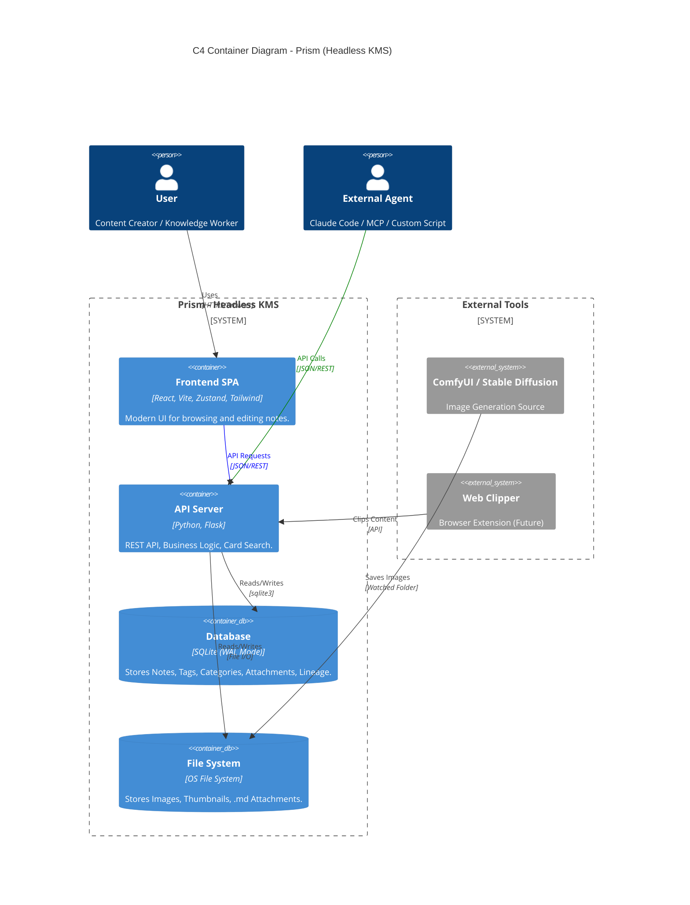

# System Architecture (C4 Model)

## Search Read Path

`GET /api/notes?q=...` 維持單一查詢入口：

- `Notes.title` / `Notes.content` 使用 SQLite FTS5 (`Notes_FTS`)。
- `Notes.remarks`、`Tags.name`、`Note_Attachments.title` / `file_path` 使用 SQL 關聯條件。
- 文字附件內容（`.md` / `.markdown` / `.txt`）由後端在 request 期間 read-only 掃描檔案內容，再把命中的 `note_id` 併回 SQL 條件。

此搜尋仍是純關鍵字比對，沒有 AI / embedding / 外部服務依賴。
