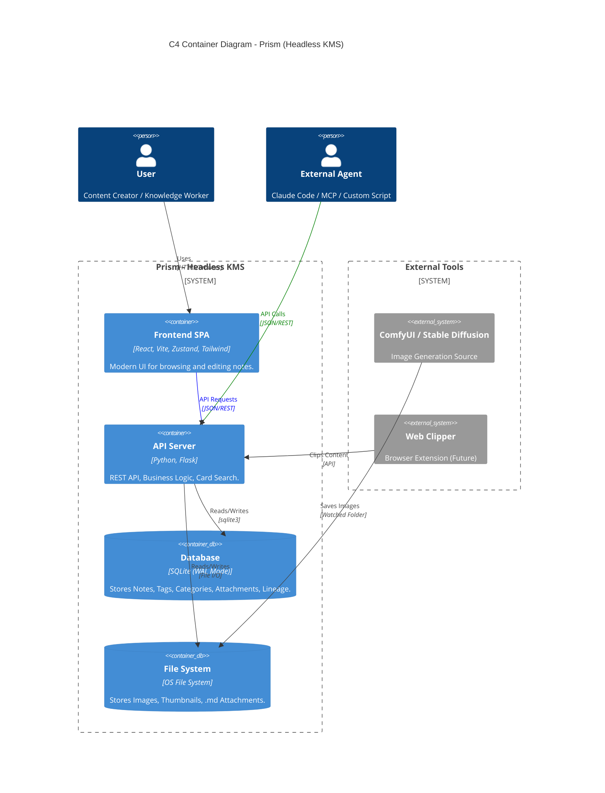
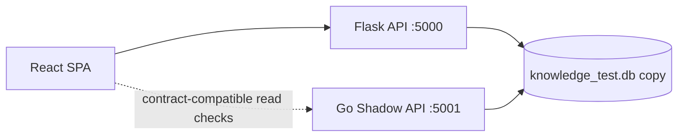

# System Architecture (C4 Model)

## Search Read Path

`GET /api/notes?q=...` 維持單一查詢入口：

- `Notes.title` / `Notes.content` 使用 SQLite FTS5 (`Notes_FTS`)。
- `Notes.remarks`、`Tags.name`、`Note_Attachments.title` / `file_path` 使用 SQL 關聯條件。
- 文字附件內容（`.md` / `.markdown` / `.txt`）由後端在 request 期間 read-only 掃描檔案內容，再把命中的 `note_id` 併回 SQL 條件。

此搜尋仍是純關鍵字比對，沒有 AI / embedding / 外部服務依賴。

## Planned Modernization Boundary

> 本節是 2026-05-27 的規劃邊界，不代表目前 runtime 已改成 Go 或新 UI。

### Go Shadow Backend

`Prism_Go_模組逐步重構計劃報告.md` 定義的方向是平行 read-only shadow backend，而不是替換現有 Flask 主線：

- Phase 0-1 只允許 read-only endpoints: `/api/test`、categories、tags、notes list、note detail、system read checks。
- Go 開發期只連 `*_test.db` / `*_dev.db`；不得碰正式 `knowledge.db`。
- 驗收標準是 Python vs Go response diff，不是單次 curl success。
- 前端不得為 Go Phase 0 改 API contract。

Phase 18.4 的 repo-local scaffold 位於 `go-shadow/`：

- `go-shadow/main.go` 只註冊核心 GET read surface，沒有 Go write route、file route、maintenance route 或 `/api/server/*`。
- 啟動時必須明確傳入 copied DB，預設拒絕名為 `knowledge.db` 的正式 DB，並對 SQLite connection 設定 `PRAGMA query_only = ON`。
- `tests/test_phase18_go_shadow_contract.py` 是 Python vs Go response diff harness；Go CLI 可用時會用同一 pytest `temp_db` 啟動 Go server 比對 Flask client JSON。沒有 Go CLI 時 runtime diff 會 skip，但 static read-only gate 仍會跑。
- 目前 Go shadow 是 contract verification target，不是前端流量來源。

Phase 19.3 新增 controlled read routing proof，但預設關閉：

- Python Flask 仍是預設 runtime owner 與 fallback owner。
- 只有設定 `PRISM_GO_READ_ROUTING=1` 且 `PRISM_GO_READ_BASE_URL` 指向 `http://localhost:<port>` / `http://127.0.0.1:<port>` / `http://[::1]:<port>` 時，`utils/go_read_routing.py` 才會在 Flask `before_request` 代理白名單 GET read surface。
- 可代理 surface 僅限 `/api/test`、`/api/categories`、`/api/tags`、`/api/notes`、`/api/notes/<id>`。
- Go sidecar 不可用、base URL 無效、非 GET method 或非白名單 path 都回到 Python。
- `GET /api/system/go-read-routing` 是 Python-owned status endpoint；proxied response 會帶 `X-Prism-Go-Read-Routing: hit`。
- 這不是 production cutover；POST/PUT/DELETE/PATCH、attachments、export、cleanup、server maintenance、migration、frontend default API target 與 `prism.service` ownership 仍屬 Python。

Phase 19.4 的 cutover readiness audit 只代表可以另開 read-only service-level cutover plan；它不授權替換 `prism.service`、更改 production frontend default、由 Go 寫 production DB、由 Go 跑 migrations、移除 Python runtime，或把 file/write routes 交給 Go。

Phase 19.5 只建立 read-only service-level cutover / soak plan：Python `prism.service` 仍是 primary runtime 與 rollback target，Go sidecar 計畫綁 `127.0.0.1:5002` 並只服務 GET read surface。19.5 不授權 live Pi service change、Caddy route change、frontend default target change 或 production DB access；19.6 必須先取得明確批准才能執行。

Phase 19.6 在明確授權後完成短暫 Pi read-only soak：Go sidecar `prism-go-readonly.service` 只綁 `127.0.0.1:5002`，Python 透過 `PRISM_GO_READ_ROUTING` 暫時代理白名單 GET，proxied response 以 `X-Prism-Go-Read-Routing: hit` 留證。Rollback drill 已移除 systemd drop-in、routing 回 `enabled=false`、停止 Go sidecar 並確認 5002 無 listener；Caddy、frontend default、write/file/maintenance/migration ownership 均未變。19.7 仍是另行授權的 post-soak decision gate，不是自動 cutover。

Phase 19.7 在另行授權後完成 bounded extended Python-switch read-only soak：從 Python-only 起點建立 fresh backup，啟動同一 localhost Go sidecar，連續 10 輪、每輪間隔 60 秒驗證白名單 GET 走 Go header，migration 與 POST 仍 Python-owned。Rollback 後 `prism.service` active、routing `enabled=false`、Go sidecar inactive、5002 無 listener。19.8 若被授權，也只能先做 reverse-proxy / service cutover 的 plan-only contract；Prism 仍沒有 built-in auth，不能把 API 當直接 public internet surface。

Phase 19.8 已補上 reverse-proxy / service cutover plan-only contract：Caddy 只可規劃把已驗證 GET read surface 路由到 localhost Go sidecar，其餘 writes/files/system/server/import/export/cleanup/frontend/static/migration 仍回 Python。19.8 未改 live Caddy、未 reload Caddy、未改 frontend default；19.9 若被授權，必須先 fresh backup、備份 Caddy config、`caddy validate`，再做短暫可回滾 drill。

### Frontend Redesign Intake

`docs/New_UI/Prism Redesign - standalone.html` 是 UI 原型參考，整合規劃在 `docs/FRONTEND-REDESIGN-PLAN.md`：

- 可採納: shell / sidebar / topbar / command palette / filter strip / card density / reading view / editor modal / settings tabs。
- 必須保留: 現有 React + Vite + Zustand + Tailwind stack、route-aware filters、`EditablePreview`、NoteEditor hooks、純關鍵字搜尋契約。
- 暫緩: `collections` / smart folders schema、server-side UI preference persistence、Wails、AI、collaboration、realtime。
- UI 改版驗收除了 typecheck / build，也需要 Browser flow 驗證實際工作流。
