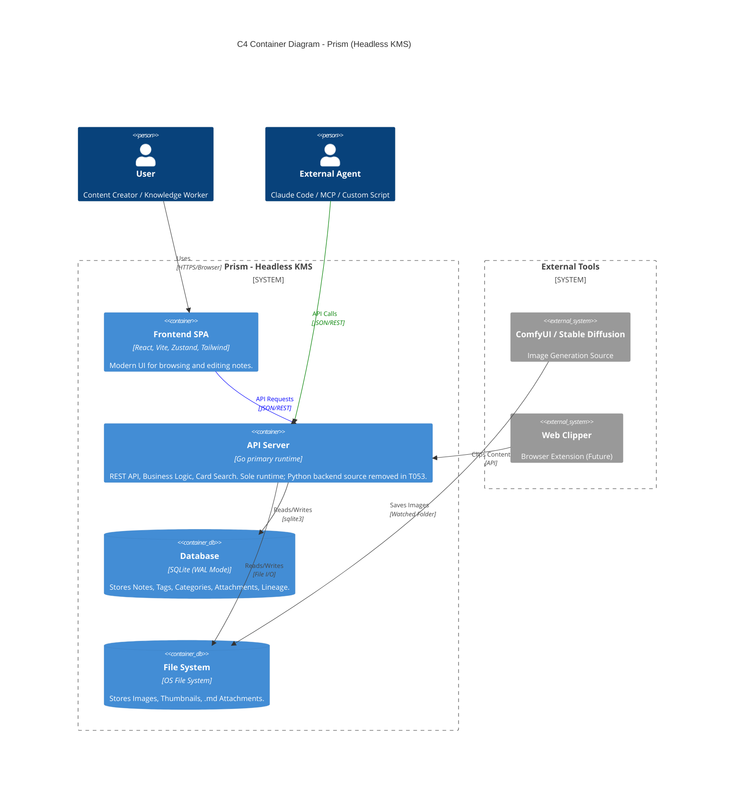

# System Architecture (C4 Model)

```mermaid
C4Context
      title C4 Container Diagram - Prism (Headless KMS)

      Person(user, "User", "Content Creator / Knowledge Worker")
      Person(agent, "External Agent", "Claude Code / MCP / Custom Script")

      System_Boundary(prism, "Prism - Headless KMS") {

            Container(frontend, "Frontend SPA", "React, Vite, Zustand, Tailwind", "Modern UI for browsing and editing notes.")
            Container(backend, "API Server", "Go primary runtime", "REST API, Business Logic, Card Search. Sole runtime; Python backend source removed in T053.")

            ContainerDb(sqlite, "Database", "SQLite (WAL Mode)", "Stores Notes, Tags, Categories, Attachments, Lineage.")
            ContainerDb(fs, "File System", "OS File System", "Stores Images, Thumbnails, .md Attachments.")
      }

      System_Boundary(integrations, "External Tools") {
            System_Ext(comfyui, "ComfyUI / Stable Diffusion", "Image Generation Source")
            System_Ext(clipper, "Web Clipper", "Browser Extension (Future)")
      }

      Rel(user, frontend, "Uses", "HTTPS/Browser")
      Rel(agent, backend, "API Calls", "JSON/REST")

      Rel(frontend, backend, "API Requests", "JSON/REST")
      Rel(backend, sqlite, "Reads/Writes", "sqlite3")
      Rel(backend, fs, "Reads/Writes", "File I/O")

      Rel(comfyui, fs, "Saves Images", "Watched Folder")
      Rel(clipper, backend, "Clips Content", "API")

      UpdateRelStyle(frontend, backend, $textColor="blue", $lineColor="blue")
      UpdateRelStyle(agent, backend, $textColor="green", $lineColor="green")
```

## Go Primary Source Layout

Go primary 仍是單一 executable 與單一 `package main`；2026-07-13 完成的 GMS-00..10 只調整 source ownership，不新增 service/package/interface，也不改 route、API、schema、migration、data-dir、desktop、package 或 deploy contract。

- `main.go`：bootstrap、runtime config / SQLite connection ownership、mux registration、middleware 與真正 shared declarations（1,024 physical lines）。
- `migrations.go`、`backups.go`、`system.go`、`options.go`：DB lifecycle、backup/restore、system/server administration 與 prompt/wizard config。
- `taxonomy.go`、`attachments.go`、`uploads.go`、`media_cleanup.go`、`image_metadata.go`：taxonomy、attachments、upload/remote-fetch、media cleanup 與 image metadata。
- `import.go`、`export.go`：JSON/Markdown/import/export/ZIP 與 rollback helpers。
- `notes_search.go`、`notes_write.go`、`notes_media.go`、`notes_actions.go`：note reads/search、writes、media coupling、actions/history/batch flows。

所有本次新增 bounded-context source files 均不超過 1,500 physical lines。Static regression 必須以整個非測試 Go package source 作為 handler/contract assertion surface；只有 mux registration ownership 仍應直接檢查 `main.go`。

## 2026-08 P1 Product Integration

- Settings 的 Data & Recovery 是 DB copy、JSON/Markdown import/export、restore-point lifecycle 與 full-data snapshot 的單一產品入口。DB download / restore points 維持 DB-only；完整 snapshot 才收集 consistent DB、uploads、attachments、notes 與 config，且 v1 只支援 manual restore。
- `GET /api/export/full-snapshot` 是 additive localhost-only Go route；staging 與 atomic ZIP 都限制在 external data-dir，契約見 `docs/contracts/full-data-snapshot-v1.md`。
- Notes list 仍維持既有 response；當頁 notes 的 tags / source URLs 改成兩個固定 batch queries hydrate，不新增 cache、schema 或 denormalization。
- React Home route 維持 eager；Prompt Builder / Settings 使用 route-level lazy chunks與可 retry fallback。FilterStrip 只屬 Home shell，Toast host 則在 shared Layout，確保 lazy routes 仍可顯示後續動作。

## Search Read Path

`GET /api/notes?q=...` 維持單一查詢入口：

- `Notes.title` / `Notes.content` 使用 SQLite FTS5 (`Notes_FTS`)。查詢含中文或日文（Han、Hiragana、Katakana）時，另外對 title / content 做子字串 `LIKE` 比對，所有 token 都要命中（PRISM-OPT-18）。純英文查詢只走 FTS 的逐 token 前綴比對。
- `Notes.remarks`、`Tags.name`、`Note_Attachments.title` / `file_path` 使用 SQL 關聯條件。
- 文字附件內容（`.md` / `.markdown` / `.txt`）由後端在 request 期間 read-only 掃描檔案內容，再把命中的 `note_id` 併回 SQL 條件。

此搜尋仍是純關鍵字比對，沒有 AI / embedding / 外部服務依賴。

已知限制（2026-10-06 審查實測，修正工單見 `docs/TODO.md`）：

- 中文／日文搜尋用 `LIKE` 掃描全文：1,000 筆約 30 ms，10,000 筆（每筆約 1,800 字）約 1 秒。若資料成長到這個量級，改用 FTS5 trigram 索引（PRISM-OPT-45）。韓文（Hangul）與全形英數字沒有特別處理。
- 長文拆分：
  - 自 PRISM-OPT-19 起，前端存檔後不再呼叫 `separate`，新的長文完整留在 `Notes.content`。
  - 既有的已拆分筆記，在編輯器存檔時會先 `restore` 收回 DB，再 PUT。
  - 尚未編輯過的已拆分筆記仍在 `docs/notes/note_<id>.md`，`Notes.content` 只有 500 字預覽，FTS、匯出與 DB 複本都只含預覽，要等 PRISM-OPT-20 一次合併。
  - `separate`／`check_separation`／`restore` 端點為了相容而保留。
- 文字附件與被拆分長文的內容只靠 request 期間逐檔掃描（200 檔 / 5 MiB / 250 ms），檔案多時常態回傳 `search_diagnostics.partial`。

## Desktop Shell Spike Boundary

`desktop-spike/` remains the isolated Windows desktop-shell Phase 0 proof: empty Win32 window, tray icon, and one shared message loop using only `golang.org/x/sys/windows`.

Desktop Shell Phase 1-3 moved the actual Windows desktop entry into `go-shadow --desktop-*`, where it can share Go primary runtime internals without importing a `main` package from the isolated spike. The Windows-only path uses WebView2 (`jchv/go-webview2`), tray Show/Quit, named mutex single-instance, file logging, and an in-process Go primary runtime goroutine that waits for `/healthz` before navigating WebView2 to `127.0.0.1:<port>`. It keeps the existing explicit external data-dir boundary and uses `prism_desktop_dev.db` for fresh desktop smoke to avoid the production-like `knowledge.db` guard.

Desktop Shell Phase 4-6 add the portable Windows package boundary. `scripts/build_desktop_portable.ps1` builds a no-install zip/folder containing `Prism.exe`, `PrismDesktop-debug.exe`, generated `Prism.ico`, Prompt Builder seed config under `static/config`, and `README-PORTABLE.md`; `Prism.exe` is linked with `-H=windowsgui` and `main.desktopShellDefault=1`, so double-clicking starts the desktop shell without a terminal. Build scripts generate a temporary `rsrc` `.syso` so the same generated icon is embedded into the Windows executable resource. The double-click portable default data dir is the executable-neighbor `PrismData\`; explicit `--data-dir` / `PRISM_GO_DATA_DIR` remains available for advanced/debug launches. The runtime does not show a first-run data-dir selector, does not write a portable choice file, and does not create or repair desktop shortcuts. Choosing between portable data, Windows account data, or a custom folder, plus Start Menu / desktop shortcuts and WebView2 bootstrap, is deferred to a future installer gate. `scripts/smoke_desktop_portable.ps1` validates a clean unzip, external data dir, fresh DB, desktop log, and basic note create/search workflow.

This remains Windows desktop shell work only. `desktop_shell_windows.go` is Windows build-tagged, `desktop_shell_other.go` keeps non-Windows stubs, and Pi deployment remains the linux/arm64 Go primary artifact with `prism-go-primary.service`, Caddy, and `DEPLOY-PI.md`. Phase 5 explicitly defers MSI/NSIS/WiX/MSIX installers and auto updaters unless a later decision gate proves they are needed.

## Deployment Topology

Windows desktop 與 Raspberry Pi 是兩條獨立交付路徑；GitHub release package 與 Pi delivery 不互相代表。

| 面向 | Windows desktop | Raspberry Pi |
|---|---|---|
| 入口 | `Prism.exe` GUI app；正式 build 不出現終端機 | systemd service 啟動 Go primary binary |
| UI | WebView2 內嵌本機 Web UI + tray | 使用瀏覽器連 `https://prism.local` / Caddy |
| Runtime | 同一行程內 desktop shell + Go server goroutine | headless Go primary service |
| 網路 | 綁 `127.0.0.1:<port>`，只給本機 WebView2 | Caddy reverse proxy 到 local service port |
| 資料 | 預設 exe 同層 `PrismData\`；`--data-dir` / env 僅作進階 override | Pi 上既有 production data dir |
| Log | 檔案 log + debug console build | journald / service log / Go runtime log |
| 打包 | portable zip / folder；installer deferred | artifact deploy + systemd + rollback / soak |
| 相依 | WebView2 Runtime、Win32 shell APIs | Linux/arm64、systemd、Caddy |
| 不共用項 | tray、window、mutex、`-H=windowsgui` | Caddy live routing、systemd enable/restart |

---

## Go Primary Runtime Migration Target

This section is the structural basis of the completed Go replacement roadmap; the full T001-T053 task table is archived in `docs/development-history/go-primary-runtime-completion-20260617.md`. The roadmap (T001-T053) is complete: Pi live/default ownership and product startup are Go primary, and T053 removed the Python backend source and converged the retained-Python wording. Go primary is the sole runtime; there is no Python main path. Since `PI-PATH-MIGRATION-01`, Pi rollback is also Go-only: every cutover preserves the previous Go artifact, SQLite backup, uploads/attachments snapshot, Caddyfile, and Go systemd unit; rollback restores that exact set and keeps legacy `prism.service` plus `prism-go-readonly.service` inactive/disabled. The shared Pi Caddyfile must be updated in-place or left unchanged when the Prism route is already correct; deployment setup must never overwrite unrelated sites.

| ID | Structural Basis | Requirement |
|---|---|---|
| ARCH-GO-PRIMARY-00 | Governance | Active TODO must stay as the single table in `docs/TODO.md`; old phase history belongs in `docs/development-history/`; task contracts belong in `docs/CONTRACTS.md`. |
| ARCH-GO-PRIMARY-01 | Route ownership | Every Flask/API route must be represented in an ownership manifest with method, handler, DB writes, file writes, side effects, and production owner. |
| ARCH-GO-PRIMARY-02 | Runtime data ownership | Go primary runtime must use an explicit external data dir for SQLite, uploads, attachments, logs, backups, config, and WAL sidecars. |
| ARCH-GO-PRIMARY-03 | Schema and migrations | Go must support fresh DB init, existing DB upgrade, Schema_Meta updates, idempotent skips, failed migration rollback, and backup-before-migrate. |
| ARCH-GO-PRIMARY-04 | Notes, files, uploads, cleanup | Go must own notes read/write/actions/history, attachment serving, uploads, upload-url, upload delete, thumbnails, orphan cleanup, originals cleanup, broken image cleanup, and note-delete image side effects. |
| ARCH-GO-PRIMARY-05 | Import/export | Go must own Markdown/JSON import, JSON/Markdown export, DB export, images export, local image bundling, restore behavior, and failure rollback. |
| ARCH-GO-PRIMARY-06 | Server/system | Go must own version/status/hardware/logs/backup/port/config/service availability surfaces before Python service can stop being runtime-critical. |
| ARCH-GO-PRIMARY-07 | Static and upload serving | SPA/static/upload serving must have an explicit Go/Caddy split; API failures must not fall through to SPA fallback. |
| ARCH-GO-PRIMARY-08 | Security | Go must preserve local/public exposure boundaries and block path traversal, SSRF, unsafe MIME, unsafe size, and unauthenticated public deployment risks. CSRF is enforced by the `csrfGate` middleware (Origin/Referer same-origin on POST/PUT/DELETE; anonymous non-browser clients pass), runtime-toggleable via `GET/POST /api/system/csrf-protection` (default on, persisted by the `.csrf_disabled` marker). |
| ARCH-GO-PRIMARY-09 | Deployment cutover | Pi cutover must prove staged Go primary, live Caddy/systemd switch, full workflow smoke, previous-Go artifact/data rollback, and soak evidence without starting a Python runtime or overwriting unrelated shared Caddy sites. |
| ARCH-GO-PRIMARY-10 | Python deletion | Python packaged runtime can be removed only after Go primary cutover, rollback, soak, and package smoke prove no production startup path depends on Python. |
- Frontend backlog is no longer the active default queue. Future frontend work requires a concrete user-selected candidate or fresh browser evidence, not automatic polish hunting.

## History

Go shadow / read-only / retained-Python 階段（Phase 18–23）、T004–T053 gate 完成敘事與 Frontend Redesign Intake 已移至 `docs/development-history/architecture-go-migration-history-20261006.md`；T001–T053 任務表見 `docs/development-history/go-primary-runtime-completion-20260617.md`。
