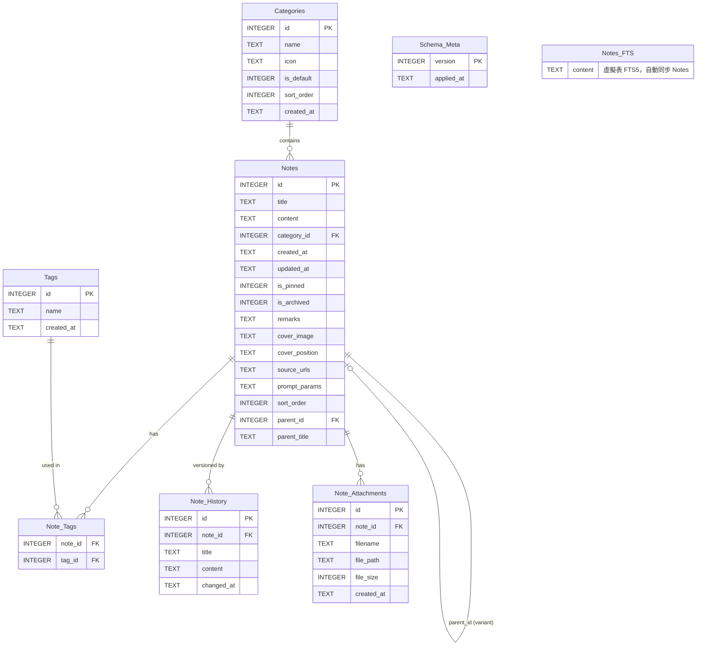

# Entity Relationship Diagram (Prism v2.3+)

> **版本**: v2.3.0 (Migration v14)
> **更新日期**: 2026-04-04
> **注意**: AI 相關欄位（`ai_summary`、`ai_tags`、`embedding_status`）及 `Embeddings`、`AI_Tasks` 表已於 v14 移除。詳見 `SCHEMA.md` Section 8。

---

## 主要關聯說明

| 關聯 | 說明 |
|------|------|
| `Notes` → `Categories` | `category_id` FK，刪除分類時筆記移至預設分類 |
| `Notes` → `Notes` | `parent_id` 自參照，支援 Prompt 卡片變體 (Phase 3.7) |
| `Notes` ↔ `Tags` | N:M 透過 `Note_Tags` 中間表 |
| `Notes` → `Note_History` | 每次 PUT /api/notes/:id 自動記錄，最多保留 50 版 |
| `Notes` → `Note_Attachments` | 長文分離後的 `.md` 附件，或手動上傳的文字附件 |
