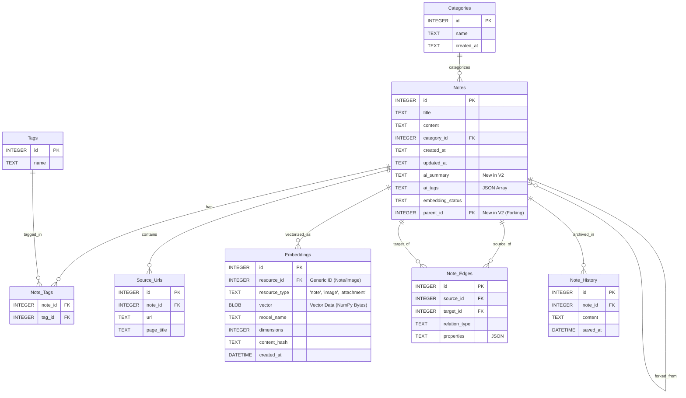

# Entity Relationship Diagram (Prism V2)

```mermaid
erDiagram
    Notes {
        INTEGER id PK
        TEXT title
        TEXT content
        INTEGER category_id FK
        TEXT created_at
        TEXT updated_at
        TEXT ai_summary "New in V2"
        TEXT ai_tags "JSON Array"
        TEXT embedding_status
        INTEGER parent_id FK "New in V2 (Forking)"
    }

    Categories {
        INTEGER id PK
        TEXT name
        TEXT created_at
    }

    Tags {
        INTEGER id PK
        TEXT name
    }

    Note_Tags {
        INTEGER note_id FK
        INTEGER tag_id FK
    }

    Source_Urls {
        INTEGER id PK
        INTEGER note_id FK
        TEXT url
        TEXT page_title
    }

    Embeddings {
        INTEGER id PK
        INTEGER resource_id FK "Generic ID (Note/Image)"
        TEXT resource_type "'note', 'image', 'attachment'"
        BLOB vector "Vector Data (NumPy Bytes)"
        TEXT model_name
        INTEGER dimensions
        TEXT content_hash
        DATETIME created_at
    }

    Note_Edges {
        INTEGER id PK
        INTEGER source_id FK
        INTEGER target_id FK
        TEXT relation_type
        TEXT properties "JSON"
    }

    Note_History {
        INTEGER id PK
        INTEGER note_id FK
        TEXT content
        DATETIME saved_at
    }

    %% Relationships
    Categories ||--o{ Notes : "categorizes"
    Notes ||--o{ Note_Tags : "has"
    Tags ||--o{ Note_Tags : "tagged_in"
    
    Notes ||--o{ Source_Urls : "contains"
    
    Notes ||--o{ Embeddings : "vectorized_as"
    
    Notes ||--o{ Note_Edges : "source_of"
    Notes ||--o{ Note_Edges : "target_of"
    
    Notes ||--o{ Note_History : "archived_in"
    
    Notes ||--o{ Notes : "forked_from"
```
