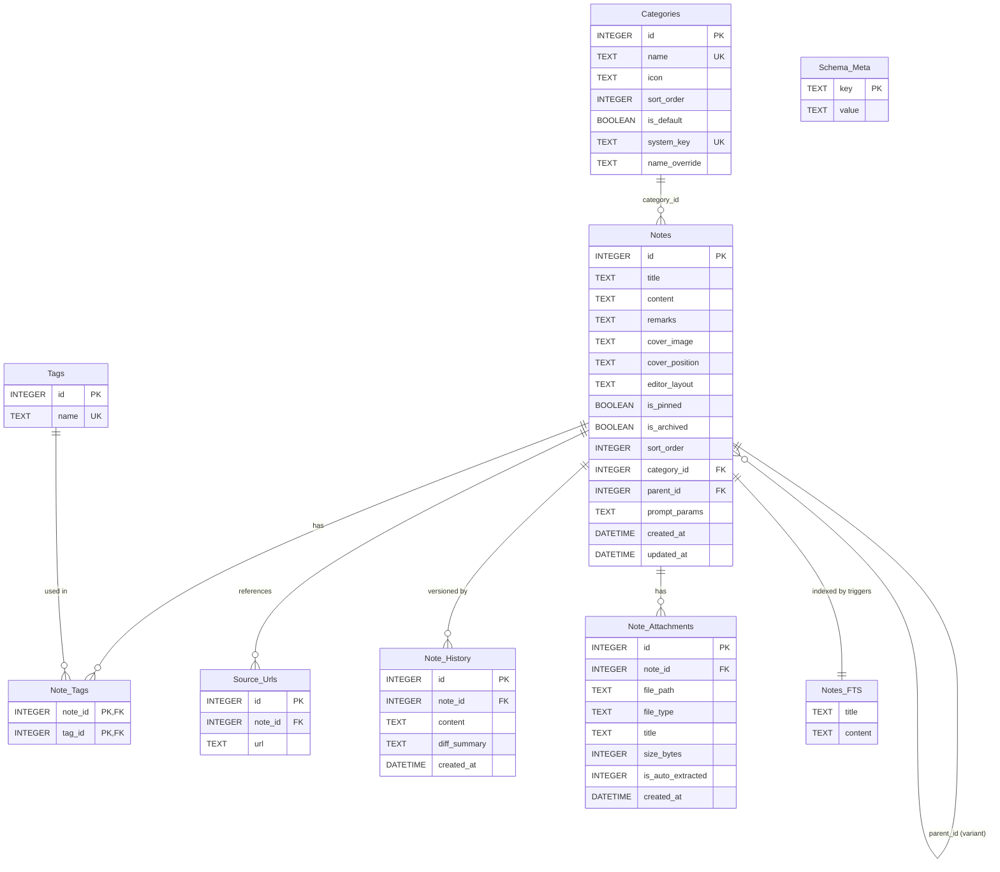

# Entity Relationship Diagram (Prism v2.5 / Migration v17)

> **版本**: v2.5 (Migration v17)
> **更新日期**: 2026-06-19
> **注意**: 本圖以 `docs/SCHEMA.md` 的現行 Go primary schema 為準。AI 相關欄位與 `Embeddings` / `AI_Tasks` 已於 v14 移除；五個系統分類身份已於 v17 改由 `Categories.system_key` 表示，使用者改名只寫 `name_override`。

---

## 主要關聯說明

| 關聯 | 說明 |
|------|------|
| `Categories` → `Notes` | `Notes.category_id` FK；刪除分類時，有筆記的分類需指定搬移目標，預設分類不可刪 |
| `Notes` → `Notes` | `parent_id` 自參照，支援 variant / duplicate-as-variant lineage；目前只表示 direct parent / direct children，不是完整版本樹 |
| `Notes` ↔ `Tags` | N:M 透過 `Note_Tags` 中間表；`Tags.name` 使用 `COLLATE NOCASE` uniqueness |
| `Notes` → `Source_Urls` | 來源 URL 拆表保存，API 層仍以陣列接收 / 回傳 |
| `Notes` → `Note_History` | 每次內容更新可保留歷史版本，最多保留 50 版 |
| `Notes` → `Note_Attachments` | `.md` / `.txt` / `.markdown` 文字附件與長文自動分離檔案；實體檔位於 Go external data dir 下 |
| `Notes` → `Notes_FTS` | FTS5 virtual table 只索引 `title` / `content`，由 INSERT / UPDATE / DELETE triggers 同步 |

## 分類身份備註

`Categories.name` 仍保留 legacy canonical name 與舊資料相容用途。現行前端顯示五個系統分類時，不再用語系文字判斷身份，而是讀 `system_key`：

| system_key | 說明 |
|---|---|
| `prompt` | 提示詞 / Prompt |
| `note` | 筆記 / Note；`is_default=1`，刪除分類搬移目標 |
| `tutorial` | 教學 / Tutorial |
| `data` | 資料 / Data |
| `inspiration` | 靈感 / Inspiration |

使用者改名系統分類時只寫 `name_override`；清除 override 後回到目前語系的預設顯示名稱。
