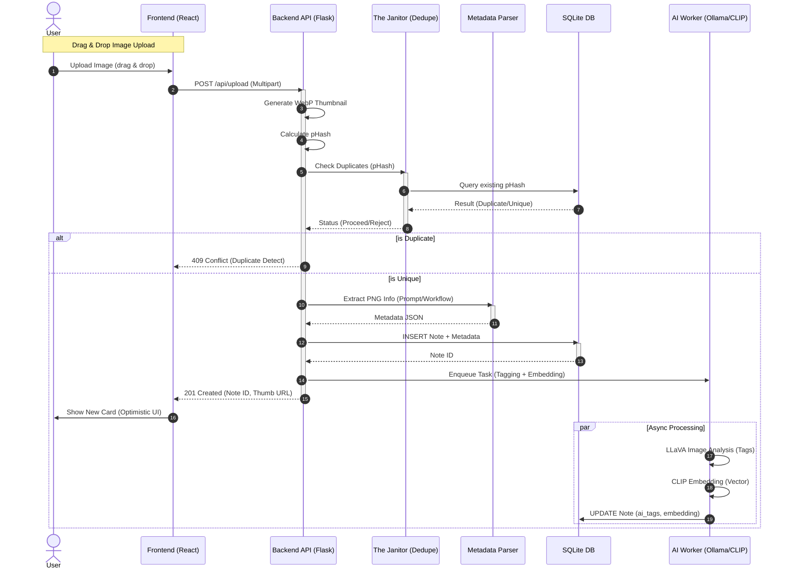

# Upload Sequence Diagram

```mermaid
sequenceDiagram
    autonumber
    
    actor User
    participant Frontend as Frontend (React)
    participant Backend as Backend API (Flask)
    participant Janitor as The Janitor (Dedupe)
    participant Parser as Metadata Parser
    participant DB as SQLite DB
    participant Async as AI Worker (Ollama/CLIP)

    Note over User, Frontend: Drag & Drop Image Upload

    User->>Frontend: Upload Image (drag & drop)
    Frontend->>Backend: POST /api/upload (Multipart)
    activate Backend
    
    Backend->>Backend: Generate WebP Thumbnail
    Backend->>Backend: Calculate pHash

    Backend->>Janitor: Check Duplicates (pHash)
    activate Janitor
    Janitor->>DB: Query existing pHash
    DB-->>Janitor: Result (Duplicate/Unique)
    Janitor-->>Backend: Status (Proceed/Reject)
    deactivate Janitor

    alt is Duplicate
        Backend-->>Frontend: 409 Conflict (Duplicate Detect)
    else is Unique
        Backend->>Parser: Extract PNG Info (Prompt/Workflow)
        activate Parser
        Parser-->>Backend: Metadata JSON
        deactivate Parser

        Backend->>DB: INSERT Note + Metadata
        activate DB
        DB-->>Backend: Note ID
        deactivate DB

        Backend->>Async: Enqueue Task (Tagging + Embedding)
        
        Backend-->>Frontend: 201 Created (Note ID, Thumb URL)
        deactivate Backend
        
        Frontend->>User: Show New Card (Optimistic UI)

        par Async Processing
            Async->>Async: LLaVA Image Analysis (Tags)
            Async->>Async: CLIP Embedding (Vector)
            Async->>DB: UPDATE Note (ai_tags, embedding)
        end
    end
```
