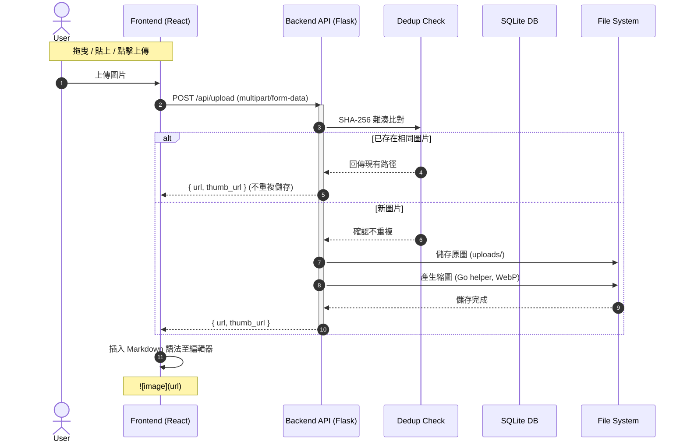
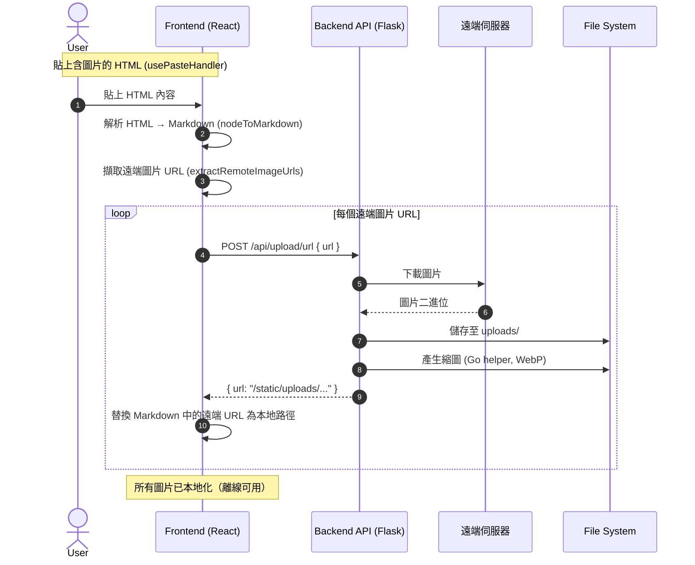
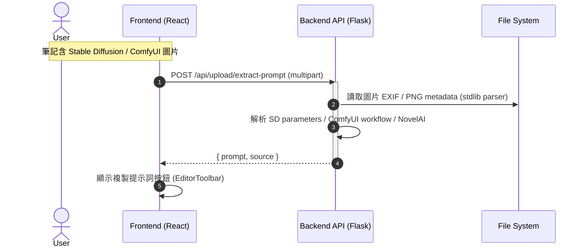

# Upload Sequence Diagram

> **版本**: v2.4.9
> **更新日期**: 2026-06-06
> **注意**: AI Worker (Ollama/CLIP) 段落已於 v2.3.0 移除。

## 圖片上傳流程

```mermaid
sequenceDiagram
    autonumber

    actor User
    participant Frontend as Frontend (React)
    participant Backend as Backend API (Flask)
    participant Dedup as Dedup Check
    participant DB as SQLite DB
    participant FS as File System

    Note over User, Frontend: 拖曳 / 貼上 / 點擊上傳

    User->>Frontend: 上傳圖片
    Frontend->>Backend: POST /api/upload (multipart/form-data)
    activate Backend

    Backend->>Dedup: SHA-256 雜湊比對
    alt 已存在相同圖片
        Dedup-->>Backend: 回傳現有路徑
        Backend-->>Frontend: { url, thumb_url } (不重複儲存)
    else 新圖片
        Dedup-->>Backend: 確認不重複
        Backend->>FS: 儲存原圖 (uploads/)
        Backend->>FS: 產生縮圖 (Go helper, WebP)
        FS-->>Backend: 儲存完成
        Backend-->>Frontend: { url, thumb_url }
    end

    deactivate Backend

    Frontend->>Frontend: 插入 Markdown 語法至編輯器
    Note over Frontend: ![image](url)
```

---

## URL 遠端圖片下載流程

```mermaid
sequenceDiagram
    autonumber

    actor User
    participant Frontend as Frontend (React)
    participant Backend as Backend API (Flask)
    participant Remote as 遠端伺服器
    participant FS as File System

    Note over User, Frontend: 貼上含圖片的 HTML (usePasteHandler)

    User->>Frontend: 貼上 HTML 內容
    Frontend->>Frontend: 解析 HTML → Markdown (nodeToMarkdown)
    Frontend->>Frontend: 擷取遠端圖片 URL (extractRemoteImageUrls)

    loop 每個遠端圖片 URL
        Frontend->>Backend: POST /api/upload/url { url }
        Backend->>Remote: 下載圖片
        Remote-->>Backend: 圖片二進位
        Backend->>FS: 儲存至 uploads/
        Backend->>FS: 產生縮圖 (Go helper, WebP)
        Backend-->>Frontend: { url: "/static/uploads/..." }
        Frontend->>Frontend: 替換 Markdown 中的遠端 URL 為本地路徑
    end

    Note over Frontend: 所有圖片已本地化（離線可用）
```

---

## Prompt 擷取流程

```mermaid
sequenceDiagram
    autonumber

    actor User
    participant Frontend as Frontend (React)
    participant Backend as Backend API (Flask)
    participant FS as File System

    Note over User, Frontend: 筆記含 Stable Diffusion / ComfyUI 圖片

    Frontend->>Backend: POST /api/upload/extract-prompt (multipart)
    activate Backend
    Backend->>FS: 讀取圖片 EXIF / PNG metadata (stdlib parser)
    Backend->>Backend: 解析 SD parameters / ComfyUI workflow / NovelAI
    Backend-->>Frontend: { prompt, source }
    deactivate Backend

    Frontend->>Frontend: 顯示複製提示詞按鈕 (EditorToolbar)
```
